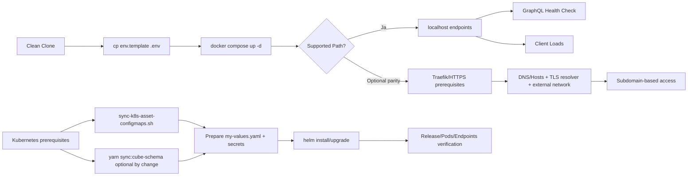

# Phase 1: Setup Stabilization & Deployment Clarity - Research

**Researched:** 2026-07-22  
**Domain:** Setup-Stabilisierung, lokale Reproduzierbarkeit, Kubernetes-Rollout-Disziplin  
**Confidence:** MEDIUM

<user_constraints>
## User Constraints (from CONTEXT.md)

### Locked Decisions
### Compose-Standardpfad definieren
- **D-01:** Offiziell unterstuetzter Default-Startpfad ist minimal: `docker compose up -d` aus dem Repo-Root.
- **D-02:** Supported Path wird strikt auf localhost + Standard-Ports begrenzt; Custom Hostnames/TLS/Proxy werden als optional gekennzeichnet.
- **D-03:** Verpflichtende Voraussetzung vor dem Start: `.env` aus `env.template` erzeugen und minimal befuellen.
- **D-04:** Mindest-Erfolgskriterium fuer "stack usable": alle Compose-Services inklusive optionaler Dienste muessen gruen sein.

### Optionale Traefik/HTTPS-Paritaet abgrenzen
- **D-05:** Traefik/HTTPS-Paritaet wird als eigenes Optional-Kapitel nach dem Default-Flow dokumentiert.
- **D-06:** Das optionale Kapitel enthaelt zwingend: Prereqs, DNS/Hosts, Zertifikat/TLS und erwartete Hostnames.
- **D-07:** Expliziter Guardrail-Hinweis: "Nicht erforderlich fuer Supported Path".
- **D-08:** Fuer den optionalen Paritaetspfad werden keine Fehlerfaelle dokumentiert.

### Startup-Validierung nach dem Hochfahren
- **D-09:** Pflicht-Checks werden als Verweise auf bestehende Befehle dokumentiert (keine eigene Soll-Ausgaben-Checkliste).
- **D-10:** Kern-Checks im Default sind auf "GraphQL Health" und "Client laedt" begrenzt.
- **D-11:** Optionale Services werden in der Validierung nicht separat dokumentiert oder verifiziert.
- **D-12:** Bei fehlgeschlagenen Pflicht-Checks wird keine konkrete Stop/Repair-Guidance in den Ablauf aufgenommen.

### Kubernetes-Praereqs und Rollout-Reihenfolge
- **D-13:** Kubernetes-Voraussetzungen werden als explizite Praereq-Matrix dokumentiert (Ingress, Storage, Netzwerk, Secrets, DNS).
- **D-14:** Rollout wird als Schrittfolge mit Gates dokumentiert: Asset-Sync -> Values -> Helm -> Verifikation.
- **D-15:** Externe Traefik-Abhaengigkeit wird als optionale Integration mit klarer Fallback-/Alternative-Notiz dokumentiert.
- **D-16:** Mindest-Verifikation nach Helm: Release healthy + Kernendpunkte erreichbar + kritische Pods Ready.

### the agent's Discretion
- Keine expliziten "you decide"-Bereiche festgelegt.

### Deferred Ideas (OUT OF SCOPE)
None — discussion stayed within phase scope.
</user_constraints>

<phase_requirements>
## Phase Requirements

| ID | Description | Research Support |
|----|-------------|------------------|
| SETUP-01 | Developer can start the baseline Docker Compose stack from a clean repository clone using the documented default path without router-level DNS hacks. | Standardpfad mit localhost-Ports, .env-Minimum, Compose-Gates, klare Trennung von Optionalpfad. |
| SETUP-02 | The documented Docker setup clearly distinguishes the supported default local path from any optional Traefik or HTTPS parity path. | Zwei explizite Flows (Supported vs Optional), Guardrail-Text und keine Vermischung in Startschritten. |
| SETUP-03 | The Docker setup documentation identifies required environment variables, optional services, and validation steps for confirming that the stack is usable after startup. | Pflichtvariablen-Matrix, optionale Profile/Services, minimaler Verifikationsablauf (GraphQL + Client). |
| SETUP-04 | Kubernetes deployment documentation lists required external dependencies and prerequisites, including ingress expectations, storage assumptions, and existing network requirements such as Traefik integration. | Praereq-Matrix fuer Helm/K8s, Ingress/TLS/Storage/Secrets/DNS/Registry Pull Secret und Traefik-Hinweise. |
| SETUP-05 | Kubernetes install and upgrade documentation describes the required ordering for asset sync, Helm values preparation, and deployment verification. | Verbindliche Reihenfolge mit Gate-Kriterien: Sync -> Values -> Helm -> Verification, plus Upgrade-Variante. |
</phase_requirements>

## Project Constraints (from copilot-instructions.md)

- Paketmanager ist strikt Yarn-only; npm-Kommandos sind nicht erlaubt. [CITED: .github/copilot-instructions.md]  
- Setup- und Laufzeitanweisungen muessen die reale Service-Kette Client -> GraphQL -> Neo4j/Keycloak abbilden. [CITED: .github/copilot-instructions.md]  
- Kubernetes-Dokumentation muss Helm- und Runtime-Assets konsistent beschreiben. [CITED: README.md] [CITED: k8s/README.md]  
- Lokale Runtime-Konfiguration wird serverseitig ueber API-Route geliefert, nicht ueber NEXT_PUBLIC Build-Zeitvariablen. [CITED: client/src/app/api/runtime-config/route.ts]  
- Sicherheits-/Auth-Flows sind Graph/Keycloak-gekoppelt; Setup-Dokumentation darf keine "guessing"-Abkuerzungen einbauen. [CITED: .github/copilot-instuctions-agent-based-reasoning.md]

## Summary

Phase 1 sollte als reine Betriebsstabilisierung umgesetzt werden: ein einziges offiziell unterstuetztes Localhost-Startmuster, danach klar abgegrenzt ein optionaler Traefik/HTTPS-Paritaetspfad. Die aktuelle Repo-Lage ist funktional, aber dokumentarisch inkonsistent: Compose ist stark auf Subdomain/TLS-Werte vorbereitet, waehrend Anforderungen explizit einen localhost-first Supported Path verlangen. [CITED: compose.yml] [CITED: env.template] [CITED: .planning/REQUIREMENTS.md]

Der wichtigste Hebel ist eine strikte Dokumentations- und Verifikationsstruktur statt Code-Umbau. Fuer SETUP-01..03 sollten README und env.template als "single operational truth" synchronisiert werden: klare Pflichtvariablen, optionale Variablen, minimales Verifikationsziel. Fuer SETUP-04..05 sollte k8s/README die schon vorhandene Sync- und Helm-Logik in eine gate-basierte Reihenfolge bringen und externe Abhaengigkeiten explizit benennen. [CITED: README.md] [CITED: k8s/README.md] [CITED: scripts/sync-k8s-asset-configmaps.sh] [CITED: scripts/sync-cube-schema.sh]

Wesentliche Risiken sind aktuell eher operativ als funktional: fehlende lokale Tooling-Verfuegbarkeit (Yarn, Helm, kubectl auf diesem Host), potenziell verwirrende Traefik-Netzwerkannahmen in Compose, und unterschiedliche Port-/URL-Erwartungen zwischen README und Runtime-Fallbacks. Diese Risiken sind mit klaren Preconditions und dokumentierten Gates beherrschbar. [CITED: compose.yml] [CITED: README.md] [CITED: client/src/app/api/runtime-config/route.ts]

**Primary recommendation:** Dokumentation und Verifikation als "Dual-Path Runbook" strukturieren (Supported localhost-first vs Optional Traefik/HTTPS), mit verbindlichen Gates je SETUP-Requirement.

## Architectural Responsibility Map

| Capability | Primary Tier | Secondary Tier | Rationale |
|------------|-------------|----------------|-----------|
| Local stack bootstrap (clone -> env -> compose up) | Runtime/Container Orchestration | Documentation | Docker Compose ist der Ausfuehrungstraeger; Doku steuert Reproduzierbarkeit. [CITED: compose.yml] |
| Runtime URL and endpoint usability | Frontend Server (Next.js runtime config) | API/Backend | Client konsumiert URLs aus runtime-config; Backend liefert Health/GraphQL. [CITED: client/src/app/api/runtime-config/route.ts] [CITED: server/src/index.ts] |
| Optional Traefik/HTTPS parity | Network/Ingress tier | Runtime/Container Orchestration | Hostname/TLS-Routing ist netzwerkseitig, Compose transportiert Labels/Netze. [CITED: compose.yml] |
| Kubernetes prerequisite clarity | Platform Operations | Documentation | Voraussetzungen (Ingress, Storage, Secrets) sind Cluster-operativ und muessen explizit dokumentiert sein. [CITED: k8s/README.md] [CITED: k8s/values.yaml] |
| Helm rollout order and verification | Platform Operations | Runtime Services | Reihenfolge steuert fehlerfreie Ausbringung von ConfigMaps, Values und Workloads. [CITED: scripts/sync-k8s-asset-configmaps.sh] [CITED: k8s/README.md] |

## Standard Stack

### Core
| Library/Tool | Version/State | Purpose | Why Standard |
|--------------|---------------|---------|--------------|
| Docker Engine + Compose | Host: Docker 29.6.2, Compose v5.3.1 | Lokaler Multi-Service-Start | Repo ist auf compose-zentrierte Service-Orchestrierung ausgelegt. [CITED: compose.yml] |
| Helm Chart in k8s/ | Chart lokal vorhanden | Kubernetes Deployment | Offizieller Cluster-Deploy-Pfad in Repo und README. [CITED: k8s/README.md] |
| Yarn Berry | packageManager yarn@4.9.1 | Einheitlicher Package Manager | Projekt erzwingt Yarn-only ueber preinstall/policies. [CITED: package.json] [CITED: client/package.json] [CITED: server/package.json] |

### Supporting
| Library/Tool | Version/State | Purpose | When to Use |
|--------------|---------------|---------|-------------|
| sync-k8s-asset-configmaps.sh | lokal vorhanden | Theme/Branding ConfigMaps vor Helm syncen | Vor jedem install/upgrade, wenn Asset-Archive genutzt werden. [CITED: scripts/sync-k8s-asset-configmaps.sh] |
| sync-cube-schema.sh | lokal vorhanden | Cube schema in Chart-Dateibaum synchronisieren | Vor packaging/upgrade nach Analytics-Modell-Aenderungen. [CITED: scripts/sync-cube-schema.sh] |

### Alternatives Considered
| Instead of | Could Use | Tradeoff |
|------------|-----------|----------|
| Localhost-first Default | Traefik-first Default | Widerspricht SETUP-01/02 und erhoeht Erstsetup-Komplexitaet. [CITED: .planning/REQUIREMENTS.md] |
| Gate-based rollout docs | Freitext ohne Gates | Hoeheres Risiko von Reihenfolgefehlern in K8s-Rollout. [CITED: k8s/README.md] |

**Installation:** Keine neuen Pakete fuer Phase 1 empfohlen; Fokus ist Dokumentation/Runbook-Klarheit. [CITED: .planning/ROADMAP.md]

## Package Legitimacy Audit

Keine neuen externen Pakete fuer diese Phase vorgesehen. Daher kein Package-Legitimacy-Gate notwendig.

| Package | Registry | Age | Downloads | Source Repo | Verdict | Disposition |
|---------|----------|-----|-----------|-------------|---------|-------------|
| none | - | - | - | - | N/A | Nicht anwendbar |

**Packages removed due to [SLOP] verdict:** none  
**Packages flagged as suspicious [SUS]:** none

## Architecture Patterns

### System Architecture Diagram

### Recommended Project Structure for Phase-1 Updates

- Root docs:
  - README.md (Default/Optional setup split, verification gates)
  - env.template (Pflicht vs Optional klar markieren)
- Kubernetes docs:
  - k8s/README.md (Praereq-Matrix + Rolloutreihenfolge)
  - k8s/values.yaml (Kommentar-Schaerfung fuer Pflichtwerte)
- Planning artefacts:
  - .planning/phases/01-setup-stabilization-deployment-clarity/01-RESEARCH.md
  - nachgelagert: Plan-/Verification-Dateien je Aufgabenpaket

### Pattern 1: Dual-Path Setup Narrative
**What:** Dokumentation in zwei strikt getrennte Flows: Supported (localhost) und Optional (Traefik/HTTPS parity).  
**When to use:** Immer wenn Compose sowohl Port-Mappings als auch Reverse-Proxy-Labels/Netze enthaelt. [CITED: compose.yml]

### Pattern 2: Gate-Based Verification
**What:** Jeder Schritt endet mit kurzem Gate (z. B. Endpoint erreichbar), bevor der naechste Schritt startet.  
**When to use:** Bei Multi-Service-Stacks mit optionalen Komponenten und externen Integrationen. [CITED: README.md] [CITED: server/src/index.ts]

### Pattern 3: Kubernetes Rollout as Ordered Pipeline
**What:** Asset Sync -> Values/Secrets -> Helm -> Cluster-Verifikation.  
**When to use:** Wenn Chart externe ConfigMaps und optionale Runtime-Stacks steuert. [CITED: k8s/README.md] [CITED: scripts/sync-k8s-asset-configmaps.sh]

### Anti-Patterns to Avoid
- **Traefik als impliziter Default:** Fuehrt zu DNS/TLS-Abhaengigkeiten fuer lokale Erstnutzung. [CITED: .planning/REQUIREMENTS.md]
- **Mischung von Pflicht- und Optionalschritten:** Erhoeht Supportaufwand und Fehlinterpretationen. [CITED: README.md]
- **Verifikation ohne Gate-Reihenfolge:** Fehler werden spaeter entdeckt und schwerer attribuierbar.

## Dokumentations- und Verifikationsstrategie (SETUP-01..SETUP-05)

| Requirement | Dokumentationsstrategie | Verifikationsstrategie |
|-------------|--------------------------|------------------------|
| SETUP-01 | README: Abschnitt "Supported Localhost Path" als einziger Default-Flow mit clone -> env -> compose. [CITED: README.md] | Gate 1: docker compose ps zeigt laufende Kernservices; Gate 2: curl auf /health erfolgreich. [CITED: server/src/index.ts] |
| SETUP-02 | README: direkt danach "Optional Traefik/HTTPS Parity" mit explizitem Nicht-Pflicht-Hinweis. [CITED: .planning/phases/01-setup-stabilization-deployment-clarity/01-CONTEXT.md] | Nur Informations-Checks (Prereqs vorhanden), keine Pflicht fuer Baseline-Freigabe. |
| SETUP-03 | env.template + README: Pflichtvariablen markieren (Minimum Set), optionale Services/Profiles separat kennzeichnen. [CITED: env.template] [CITED: compose.yml] | Minimal-Gates: GraphQL Health und Client-Ladefaehigkeit; keine optionalen Service-Gates im Default. [CITED: server/src/index.ts] [CITED: README.md] |
| SETUP-04 | k8s/README: Praereq-Matrix fuer Ingress, StorageClass, DNS, Secrets, Registry Pull Secret, optional cert-manager/Traefik. [CITED: k8s/README.md] [CITED: k8s/values.yaml] | Prereq-Checkliste vor Helm: kubectl/helm verfuegbar, Namespace, Secret-Strategie geklaert, StorageClass bekannt. |
| SETUP-05 | k8s/README: install/upgrade als feste Reihenfolge inkl. asset sync und values prep. [CITED: k8s/README.md] [CITED: scripts/sync-k8s-asset-configmaps.sh] | Rollout-Gates: helm status deployed, kritische Pods Ready, Kernendpunkte erreichbar. |

## Verification Command Strategy (Operational)

Hinweis: Diese Strategie referenziert bestehende Kommandos und fuehrt keine neuen Tool-Anforderungen ein.

1. Localhost baseline
- cp env.template .env
- docker compose up -d
- docker compose ps
- curl -fsS http://localhost:4000/health
- Aufruf von http://localhost:3000 im Browser

2. Optional parity (nur wenn bewusst aktiviert)
- Pruefung auf vorhandenes externes Traefik-Netz
- Pruefung DNS/Hosts + TLS resolver Werte in .env
- Kein Baseline-Blocker bei Auslassung

3. Kubernetes install path
- ./scripts/sync-k8s-asset-configmaps.sh --namespace <ns> --release <rel> --values <values>
- optional: yarn sync:cube-schema (nur wenn Cube-Modell geaendert)
- helm install <rel> ./k8s -f <values> -n <ns> --create-namespace
- helm status <rel> -n <ns>
- kubectl get pods -n <ns>

4. Kubernetes upgrade path
- ./scripts/sync-k8s-asset-configmaps.sh ...
- optional: yarn sync:cube-schema
- helm upgrade <rel> ./k8s -f <values> -n <ns>
- helm status / pod readiness / endpoint checks

## Proposed Artifact Map (Planung -> Ausfuehrung)

| Area | Files to Update | Purpose |
|------|-----------------|---------|
| Phase planning | .planning/phases/01-setup-stabilization-deployment-clarity/01-RESEARCH.md | Forschungsbasis und Empfehlungen |
| Phase execution docs | README.md | Supported vs Optional Setup klar trennen, Default path fixieren |
| Env clarity | env.template | Pflicht-/Optionalvariablen und lokale Defaults schaerfen |
| K8s prereqs | k8s/README.md | Matrix fuer Abhaengigkeiten + Rollout-Gates |
| K8s defaults docs | k8s/values.yaml | Klarere Kommentare zu Pflichtsecrets und optionalen Features |
| Optional scripts references | scripts/sync-k8s-asset-configmaps.sh, scripts/sync-cube-schema.sh | Reihenfolge und Gate-Integration dokumentieren |
| Verification artifacts (nachgelagert) | .planning/phases/01-setup-stabilization-deployment-clarity/01-PLAN.md, .planning/phases/01-setup-stabilization-deployment-clarity/01-VERIFICATION.md | Umsetzungs- und Nachweisstruktur pro Requirement |

## Don't Hand-Roll

| Problem | Don't Build | Use Instead | Why |
|---------|-------------|-------------|-----|
| Runtime orchestration docs | Neues internes Tool fuer Setup-Generierung | Bestehende README + Compose + Script-Kommandos | Geringeres Risiko, direkt am Ist-System ausgerichtet. [CITED: README.md] [CITED: compose.yml] |
| K8s release orchestration | Eigenes Deploy-Skript-Framework | Helm + vorhandene Sync-Skripte | Chart und Skripte sind bereits operationalisiert. [CITED: k8s/README.md] |
| Client config propagation | NEXT_PUBLIC-Rebuild-Pipeline | runtime-config endpoint beibehalten | Bereits implementierter Laufzeitmechanismus. [CITED: client/src/app/api/runtime-config/route.ts] |

**Key insight:** Phase 1 braucht vor allem Klarheit und Reihenfolge, nicht neue Infrastruktur.

## Common Pitfalls

### Pitfall 1: "Supported Path" beschreibt indirekt Traefik-Annahmen
**What goes wrong:** Nutzer glauben, DNS/Subdomains seien Pflicht fuer Localhost-Baseline.  
**Why it happens:** Compose enthaelt umfangreiche Traefik-Labels/Netzwerke neben Port-Mappings. [CITED: compose.yml]  
**How to avoid:** README strikt in Default vs Optional splitten und Guardrail prominent platzieren.  
**Warning signs:** Issues mit "cannot resolve host" trotz laufender Container.

### Pitfall 2: Falsche Erfolgsdefinition fuer Baseline
**What goes wrong:** "Stack usable" wird uneinheitlich interpretiert.  
**Why it happens:** Viele Services, aber nur wenige sind fuer Kernnutzbarkeit notwendig. [CITED: compose.yml]  
**How to avoid:** Pflicht-Gates auf GraphQL Health + Client Load begrenzen (gem. D-10).  
**Warning signs:** Team diskutiert optionalen Service-Ausfall als Hard-Blocker.

### Pitfall 3: Kubernetes-Reihenfolge ohne harte Gates
**What goes wrong:** Helm-Rollouts passieren vor Asset-Sync oder ohne values-Haertung.  
**Why it happens:** Ablauf oft als lose Befehlsliste dokumentiert. [CITED: k8s/README.md]  
**How to avoid:** Gate-basierte Pipeline mit klarer Reihenfolge dokumentieren.  
**Warning signs:** Fehlende ConfigMaps, inkonsistente Branding/Theme-Artefakte.

### Pitfall 4: Tooling-Luecke auf Operator-Host
**What goes wrong:** Geplante Verifikation kann lokal nicht ausgefuehrt werden.  
**Why it happens:** Yarn, helm, kubectl fehlen in Umgebung. [CITED: local runtime probe 2026-07-22]  
**How to avoid:** Prereq-Check am Anfang jedes Flows + klarer Blocker-Hinweis.  
**Warning signs:** Befehle scheitern mit "command not found".

## Risiken, Unbekannte, Mitigationen

| Risk/Unknown | Impact | Mitigation |
|--------------|--------|------------|
| Externes Traefik-Netz als Compose-Annahme (TRAEFIK_NETWORK) | Default-Start kann scheitern, wenn Netzwerk nicht existiert | In Doku als Optionalpfad markieren; Supported Path darf ohne Traefik auskommen. [CITED: compose.yml] |
| Inkonsistente lokale Port-/URL-Erwartungen in Doku vs Runtime-Fallbacks | Verwirrung bei Access-Checks | Endpunkt-Tabelle in README auf reale localhost-Ports normalisieren. [CITED: README.md] [CITED: client/src/app/api/runtime-config/route.ts] |
| Host ohne Yarn/Helm/kubectl | Verifikation und K8s-Flow blockiert | Prereq-Abschnitt mit minimalem Install-Hinweis und Blocker-Status. [CITED: local runtime probe 2026-07-22] |
| D-04 vs D-11 Spannungsfeld ("alle Services gruen" vs "optionale nicht verifizieren") | Missverstaendliche Abnahme | In Plan als explizite Interpretationsentscheidung festhalten: "alle aktivierten Services" vs "alle definierten Services". [ASSUMED] |

## Code/Config Evidence Snippets

- GraphQL Health Endpoint existiert unter /health und ist fuer Default-Gate geeignet. [CITED: server/src/index.ts]
- Client Runtime nutzt serverseitige Runtime-Konfiguration und hat localhost-Fallbacks. [CITED: client/src/app/api/runtime-config/route.ts]
- Optionale AI-Services sind ueber Compose Profile steuerbar. [CITED: compose.yml] [CITED: README.md]
- K8s-Assets werden absichtlich ausserhalb Helm-Release-Secret synchronisiert. [CITED: k8s/README.md] [CITED: scripts/sync-k8s-asset-configmaps.sh]

## State of the Art

| Old Approach | Current Approach | When Changed | Impact |
|--------------|------------------|--------------|--------|
| Build-time NEXT_PUBLIC config assumption | Runtime config API fuer Client | Bereits im aktuellen Stand | Ermöglicht Environment-Wechsel ohne Frontend-Rebuild. [CITED: client/src/app/api/runtime-config/route.ts] |
| Helm-only payload inkl. grosse Assets | Externe Asset ConfigMaps via Sync-Script | Bereits im aktuellen Stand | Schlankere Releases, aber zusaetzlicher Rollout-Schritt notwendig. [CITED: k8s/README.md] |

**Deprecated/outdated:**
- Versteckte Router-/DNS-Annahmen als Pflicht fuer lokalen Start sind nicht kompatibel mit Phase-1-Ziel. [CITED: .planning/REQUIREMENTS.md]

## Assumptions Log

| # | Claim | Section | Risk if Wrong |
|---|-------|---------|---------------|
| A1 | D-04 sollte als "alle aktivierten Services gruen" gelesen werden, nicht zwingend alle optionalen Profile | Risiken, Unbekannte, Mitigationen | Falsche Abnahmekriterien koennen Phase-Completion blockieren |
| A2 | Keine Code-Aenderung in compose.yml ist erforderlich; Doku-Aenderungen reichen fuer SETUP-01..05 | Summary | Falls falsch, muesste zusaetzlich Infrastrukturcode geaendert werden |

## Open Questions (RESOLVED)

1. Wie soll D-04 final operationalisiert werden? (RESOLVED)
- Resolution: Der Phase-1-Plan setzt D-04 als pruefbaren Gesamt-Gate ueber den gestarteten Service-Satz um (`config --services` gegen `ps --status running --services`), inklusive optionaler Dienste im aktivierten Profil. Damit ist die Abnahmeformel explizit und maschinell pruefbar.

2. Soll der Supported Path ohne externes Traefik-Netz garantiert sein? (RESOLVED)
- Resolution: Ja fuer den dokumentierten Default-Pfad. Traefik/HTTPS bleibt ein optionaler Paritaetspfad mit eigener Prereq-Sektion und ohne Blockerwirkung fuer den localhost-first Supported Path.

## Environment Availability

| Dependency | Required By | Available | Version | Fallback |
|------------|------------|-----------|---------|----------|
| node | lokale Scripts/Dev tooling | Ja | v24.18.0 | - |
| yarn | Projektstandard, sync:cube-schema, package scripts | Nein | - | Blocker fuer script-basierte Verifikation |
| docker | Compose baseline | Ja | 29.6.2 | - |
| docker compose | Compose orchestration | Ja | v5.3.1 | - |
| kubectl | K8s verification | Nein | - | Kein direkter Fallback |
| helm | K8s install/upgrade | Nein | - | Kein direkter Fallback |
| curl | Health checks | Ja | 8.14.1 | - |
| jq | optionale JSON-Auswertung | Ja | 1.7 | - |

**Missing dependencies with no fallback:**
- yarn
- kubectl
- helm

**Missing dependencies with fallback:**
- none

## Validation Architecture

### Test Framework
| Property | Value |
|----------|-------|
| Framework | Jest im server package; kein vollstaendiges End-to-End-Setup fuer Setup-Dokumentationsfluss [CITED: server/package.json] |
| Config file | Nicht explizit in Phase-1-Artefakten referenziert |
| Quick run command | curl -fsS http://localhost:4000/health (runtime smoke gate) |
| Full suite command | yarn test (wenn Yarn verfuegbar) [CITED: package.json] |

### Phase Requirements -> Test Map
| Req ID | Behavior | Test Type | Automated Command | File Exists? |
|--------|----------|-----------|-------------------|-------------|
| SETUP-01 | Compose baseline startet reproduzierbar | smoke | docker compose up -d && docker compose ps | Ja |
| SETUP-02 | Default- vs Optional-Flow klar getrennt | docs-review + smoke | grep/Checklist auf README-Struktur + baseline smoke | Wave 0 |
| SETUP-03 | Pflichtvariablen/Optionale Dienste/Validation klar | docs-review + smoke | cp env.template .env && docker compose up -d && curl -fsS /health | Ja |
| SETUP-04 | K8s-Praereqs explizit dokumentiert | docs-review | Checkliste gegen k8s/README + values kommentare | Wave 0 |
| SETUP-05 | K8s-Reihenfolge und Verification beschrieben | docs-review + operational smoke | sync script + helm status + kubectl get pods | Wave 0 (tools fehlen lokal) |

### Sampling Rate
- **Per task commit:** README/k8s README Konsistenzcheck + Health smoke
- **Per wave merge:** Compose baseline smoke + (wenn verfuegbar) Helm dry operational verification
- **Phase gate:** Alle SETUP-Requirements mit dokumentierter Evidence-Checklist abgehakt

### Wave 0 Gaps
- [ ] Dokumentierte, repo-nahe Verification-Checklist fuer SETUP-02/04/05 fehlt als formaler Artefaktpfad
- [ ] Lokale Verifikationsumgebung hat keinen Yarn/Helm/kubectl (Blocker fuer Full-Gates)

## Security Domain

### Applicable ASVS Categories

| ASVS Category | Applies | Standard Control |
|---------------|---------|-----------------|
| V2 Authentication | yes | Keycloak realm/client Konfiguration und JWT/JWKS Flows [CITED: compose.yml] [CITED: server/src/index.ts] |
| V3 Session Management | yes | Token-Weitergabe ueber API/GraphQL-Kontext, Keycloak-gestuetzt [CITED: server/src/index.ts] |
| V4 Access Control | yes | Backend/Auth-Kontext ueber Keycloak und GraphQL-Autorisierungsmuster |
| V5 Input Validation | yes | Env-/values-basierte Konfigurationsgrenzen, keine freie Query-Ausfuehrung in diesem Phase-Scope |
| V6 Cryptography | yes | TLS optional in K8s/Ingress/Traefik dokumentiert, keine Eigenkrypto einfuehren [CITED: k8s/README.md] |

### Known Threat Patterns for this Stack

| Pattern | STRIDE | Standard Mitigation |
|---------|--------|---------------------|
| Falsch konfigurierte Ingress/TLS-Pfade | Tampering/Information Disclosure | Optionalpfad klar isolieren, Secret/TLS-Praereqs dokumentieren |
| Unvollstaendige Secret-Konfiguration in Helm values | Elevation/Information Disclosure | Required values + existingSecret-Optionen explizit dokumentieren [CITED: k8s/README.md] [CITED: k8s/values.yaml] |
| Fehlende Runtime-Prereqs auf Operator Host | Denial of Service (operational) | Vorab-Checkliste fuer Tools und Versionen |

## Sources

### Primary (HIGH confidence)
- [CITED: .planning/ROADMAP.md] - Phase 1 Ziel, Scope, Success Criteria
- [CITED: .planning/REQUIREMENTS.md] - SETUP-01..SETUP-05 Anforderungen
- [CITED: .planning/phases/01-setup-stabilization-deployment-clarity/01-CONTEXT.md] - Locked decisions D-01..D-16
- [CITED: compose.yml] - Tatsachliche Service-Topologie, Ports, Profiles, Traefik-Labels
- [CITED: env.template] - Variableninventar und lokale Defaults
- [CITED: README.md] - Aktueller Setup- und K8s-Flow
- [CITED: k8s/README.md] - Helm prerequisites, install/upgrade Reihenfolge
- [CITED: k8s/values.yaml] - Pflicht/Optional-Konfigurationsannahmen
- [CITED: scripts/sync-k8s-asset-configmaps.sh] - Asset-Sync-Verhalten
- [CITED: scripts/sync-cube-schema.sh] - Cube-Schema-Sync-Verhalten
- [CITED: client/src/app/api/runtime-config/route.ts] - Runtime-Konfigurationsquelle
- [CITED: server/src/index.ts] - GraphQL/Health Verifikationsendpunkte

### Secondary (MEDIUM confidence)
- [CITED: local runtime probe 2026-07-22] - Tool-Verfuegbarkeit auf aktuellem Host

### Tertiary (LOW confidence)
- [ASSUMED] Operationalisierung von D-04 als "alle aktivierten Services" statt "alle theoretisch definierten Services"

## Metadata

**Confidence breakdown:**
- Standard stack: HIGH - direkt aus Repo-Artefakten ableitbar
- Architecture: MEDIUM - belastbar fuer vorhandene Struktur, aber mit offenen Betriebsannahmen
- Pitfalls: MEDIUM - aus Artefakten und beobachteter Tool-Lage abgeleitet

**Research date:** 2026-07-22  
**Valid until:** 2026-08-21

## RESEARCH COMPLETE
