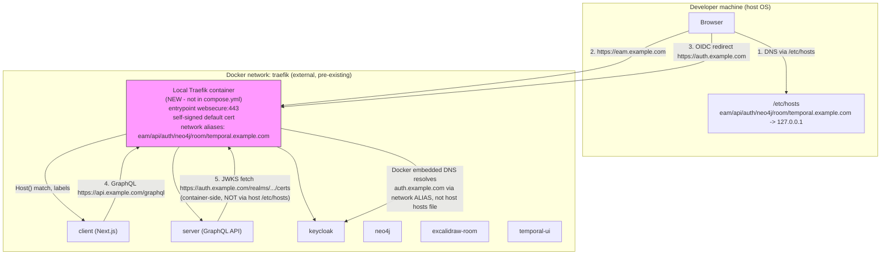

# Phase 01.1: eam.example.com local domain setup - Research

**Researched:** 2026-07-27
**Domain:** Local Docker Compose hostname routing via an externally-managed Traefik reverse proxy, in front of a Keycloak-backed OIDC login flow
**Confidence:** HIGH

## Summary

The `eam.example.com` Optional Path is broken today for one simple, verifiable reason: **no Traefik container exists on this machine** (`docker ps -a --filter name=traefik` returns empty), even though the `traefik` external Docker network exists and 6 containers (`client`, `server`, `keycloak`, `neo4j`, `excalidraw-room`, `temporal-ui`) are already attached to it and already carry correct Traefik routing labels. `.env` is byte-for-byte identical to `env.template` (`diff` returns no output) — `BASE_DOMAIN=example.com`, `TRAEFIK_NETWORK=traefik`, `TRAEFIK_CERTRESOLVER=my-traefik-cert-resolver` (a placeholder, not empty). `/etc/hosts` has no entry for `eam.example.com` or any sibling subdomain — only an unrelated `127.0.1.1 eam.wien.arthofer.dev eam` line from another project (PVE-managed), which does not collide with `example.com` FQDNs.

Restoring the path requires three independent fixes, not just "start a Traefik container":

1. **Start a local Traefik instance** attached to the pre-existing external `traefik` network (do not touch `compose.yml` — D-04/D-05). Existing Traefik labels in `compose.yml` are correct and sufficient as-is; no label changes are needed.
2. **Set `TRAEFIK_CERTRESOLVER=` (empty) in `.env`** so no local Traefik logs errors trying to resolve a real ACME certificate for `example.com` (a domain the developer doesn't control) — Traefik falls back to its built-in self-signed default certificate for any router whose declared resolver isn't registered `[CITED: doc.traefik.io/traefik/v3.0/https/tls]`.
3. **Give container-to-container calls a way to resolve `auth.example.com`** — this is the non-obvious root cause the CONTEXT.md evidence doesn't fully explain. The `server` container's own JWKS/token-validation code calls `https://auth.example.com/realms/.../certs` directly using `process.env.KEYCLOAK_URL` (verified in [server/src/graphql/schema.ts](../../../server/src/graphql/schema.ts) and [server/src/auth/auth-jwks.ts](../../../server/src/auth/auth-jwks.ts)). Docker containers do **not** inherit the host's `/etc/hosts` file `[CITED: docs.docker.com/engine/network — "Custom hosts... aren't inherited by containers"]`, and a custom-network container's DNS lookups for names Docker doesn't recognize are forwarded to the **host's upstream DNS resolvers**, not the host's hosts file `[CITED: docs.docker.com/engine/network — "DNS services"]`. Since `example.com` is a real, publicly resolvable IANA reserved domain, the `server` container would silently resolve `auth.example.com` to the real internet — not the local Traefik — and JWKS validation (hence all authenticated GraphQL calls) would fail even after fixing (1) and (2). The fix is to give the **local Traefik container itself** Docker network aliases for every subdomain on the shared `traefik` network (`docker network connect ... --alias` or Compose `networks.traefik.aliases`), so any container on that same network (including `server`) resolves `auth.example.com` via Docker's embedded DNS straight to the local Traefik container.

**Primary recommendation:** Document a standalone `traefik.local.yml` Compose snippet (network-alias based, self-signed default cert, no certresolver) plus `.env` edits (`TRAEFIK_CERTRESOLVER=`, `TEMPORAL_UI_CERTRESOLVER=`) and 6 `/etc/hosts` entries, in the README's existing "Optional Path" section — no changes to `compose.yml` or `auth/src/realm-export.json`.

## User Constraints (from CONTEXT.md)

### Locked Decisions
- **D-01:** The urgent driver is a real functional break, not just missing docs: `auth/src/realm-export.json` hardcodes the Keycloak client's `redirectUris`/`webOrigins` to `https://eam.example.com/*` only — there is no `localhost:3000` entry. SSO login through the Phase-1 "Supported Path" (localhost-first) is therefore expected to fail today. Restoring `eam.example.com` routing is what makes login work again, and that is the concrete success condition for this phase (not merely re-adding docs text).
- **D-02:** No changes to `auth/src/realm-export.json` / `k8s/realm-export.json` redirect URIs are in scope — they already correctly target `eam.example.com`, `api.example.com`, etc. The fix is entirely on the runtime/config/reverse-proxy side (`.env` values, hosts entry, Traefik), not the Keycloak realm data.
- **D-03:** Adding a `localhost:3000` redirect URI to the dev realm is a deferred, separate improvement — not part of this phase.
- **D-04:** No Traefik container currently runs locally, but the `traefik` Docker network is already declared `external: true` in `compose.yml` and 6 containers are already attached to it. Traefik is an external, developer-managed reverse proxy, not something this repo's `compose.yml` should own or start itself.
- **D-05:** Do **not** add a Traefik service to `compose.yml`. Instead, document a copy-paste-able minimal local Traefik snippet (separate, clearly optional) so a developer without an existing Traefik instance can stand one up. — Reversible; pure documentation/optional snippet, no effect on the Supported Path or data model.
- **D-06:** Use Traefik's default self-signed certificate for the local `eam.example.com` router (leave `TRAEFIK_CERTRESOLVER` empty/unset for local use — a real ACME/Let's Encrypt challenge cannot succeed for `example.com`). Document the expected browser self-signed-certificate warning as normal for this optional local path.
- **D-07:** `mkcert`-based trusted local certificates are an optional future enhancement, **not required** for this phase.
- **D-08:** Phase 1's "Supported Path (localhost-first)" default remains unchanged and is not reopened. `eam.example.com` stays documented as the "Optional Path: Traefik/HTTPS parity" — this phase makes that optional path actually functional again instead of aspirational/broken.
- **D-09:** Documentation must explicitly call out the login caveat: SSO via the Supported (localhost) Path does not currently work because of the Keycloak redirect URI configuration (D-01/D-02); the Optional Path (`eam.example.com`) is the one that supports login end-to-end today.

### the agent's Discretion
- Exact wording/placement of the new README/env.template guidance, and the specific `.env` values to set as an example (`BASE_DOMAIN=example.com`, `CLIENT_SUBDOMAIN=eam`, `TRAEFIK_NETWORK=traefik`, `TRAEFIK_CERTRESOLVER=` empty) are left to research/planning to finalize against the live repo files.
- Whether a helper script (e.g., checking/adding the `/etc/hosts` entries for all subdomains: `eam`, `api`, `auth`, `neo4j`, `room`, `temporal`) is added versus purely documented as manual steps is left open for planning to decide, based on Phase 1's documentation-first style.

### Deferred Ideas (OUT OF SCOPE)
- Add `localhost:3000` redirect URI to the dev Keycloak realm so the Supported (localhost-first) Path also supports SSO login end-to-end. Touches auth realm data — out of scope.
- `mkcert`-based trusted local TLS for `eam.example.com` to remove the self-signed browser warning — polish, not required.
- Automated `/etc/hosts` management (script to add/verify subdomain entries) — left to planning's discretion, not decided here.

## Architectural Responsibility Map

| Capability | Primary Tier | Secondary Tier | Rationale |
|------------|-------------|----------------|-----------|
| Hostname → local-IP resolution for the browser | Host OS (`/etc/hosts`) | — | Only the host OS resolver is consulted by the browser; Docker networking is irrelevant to browser-side DNS. |
| TLS termination for `*.example.com` | External/local Traefik (reverse proxy) | — | `compose.yml` intentionally has no Traefik service; TLS termination is delegated to a developer-managed, out-of-repo Traefik instance (D-04/D-05). |
| Request routing to the correct container by `Host()` | External/local Traefik (reverse proxy) | Docker `traefik` network | Traefik's Docker provider reads labels already present on 6 services in `compose.yml`; routing logic requires no changes. |
| Container → Keycloak hostname resolution (JWKS/token validation) | Docker embedded DNS + network aliases | `server`, `ai-server`, `ai-worker`, `analytics-worker` (API/Backend tier) | These backend containers call `KEYCLOAK_URL` (`https://auth.example.com`) directly from Node.js code — this never goes through the browser or the host's `/etc/hosts`; it is a pure container-to-container concern that must be solved with Docker network aliases on the shared `traefik` network. |
| Realm redirect URI / webOrigins configuration | Keycloak realm data (`auth/src/realm-export.json`) | — | Out of scope for this phase (D-02); already correctly targets `eam.example.com`/`api.example.com`. |
| `.env` variable values (`BASE_DOMAIN`, `*_SUBDOMAIN`, `TRAEFIK_*`) | Runtime/config tier | — | The seam between Compose labels and the Keycloak realm's hardcoded redirect URIs; must line up exactly for OIDC redirects and container-side JWKS calls to succeed. |

## Standard Stack

### Core
No new libraries/packages are introduced by this phase. This is a Docker Compose / reverse-proxy configuration and documentation phase.

| Component | Version | Purpose | Why Standard |
|-----------|---------|---------|---------------|
| Traefik | `v3.7.8` (cached locally `[VERIFIED: local docker images cache]`; `v3.3` also cached) | Local reverse proxy terminating TLS for `*.example.com` and routing by `Host()` to the already-labeled Compose services | Already the project's chosen ingress technology (labels exist project-wide); developer machine already has Traefik images cached, confirming prior local use. |

### Package Legitimacy Audit

**Not applicable.** This phase installs no npm/pip/cargo packages — it configures an existing Docker image (`traefik`) already present on the developer's machine and edits `.env`/README/hosts. The Package Legitimacy Gate is skipped per its own scope condition ("whenever this phase installs external packages").

## Architecture Patterns

### System Architecture Diagram



Key point the diagram makes explicit: arrow (5) is the failure mode that documentation-only fixes miss. The `server` container's request to `auth.example.com` never touches the host's `/etc/hosts` — it is resolved entirely inside the `traefik` Docker network, which is why the local Traefik container needs **network aliases**, not just a running container.

### Recommended Project Structure
No new source directories. Deliverables are:
```
README.md                 # extend existing "Optional Path" section (§5) with working restoration steps
env.template              # optional: add inline comment guidance for local-Traefik values (no new vars needed)
traefik.local.yml          # NEW — standalone, optional Compose snippet for a local Traefik instance (not referenced by compose.yml)
```

### Pattern 1: External Traefik network with per-router labels (already implemented)
**What:** Every service that needs Optional Path routing declares `traefik.enable=true` plus `Host()` router rules referencing `${*_SUBDOMAIN}.${BASE_DOMAIN}`, and joins the pre-existing external `traefik` network.
**When to use:** Already fully implemented in `compose.yml` for `neo4j`, `server`, `keycloak`, `excalidraw-room`, `temporal-ui`, `client`. No changes needed.
**Example (existing, unmodified):**
```yaml
# Source: compose.yml (keycloak service, unchanged)
networks:
  - eam-network
  - ${TRAEFIK_NETWORK}
labels:
  - "traefik.enable=true"
  - "traefik.http.routers.${COMPOSE_PROJECT_NAME:-nextgen-eam}-keycloak.rule=Host(`${AUTH_SUBDOMAIN}.${BASE_DOMAIN}`)"
  - "traefik.http.routers.${COMPOSE_PROJECT_NAME:-nextgen-eam}-keycloak.entrypoints=websecure"
  - "traefik.http.routers.${COMPOSE_PROJECT_NAME:-nextgen-eam}-keycloak.tls=true"
  - "traefik.http.routers.${COMPOSE_PROJECT_NAME:-nextgen-eam}-keycloak.tls.certresolver=${TRAEFIK_CERTRESOLVER}"
  - "traefik.docker.network=${TRAEFIK_NETWORK}"
```

### Pattern 2: Local Traefik with network aliases (NEW — the actual fix)
**What:** A standalone, optional Compose file that starts a Traefik instance attached to the existing external `traefik` network, with Docker network aliases for every subdomain hostname used both by the browser AND by container-to-container calls.
**When to use:** Developer has no existing shared Traefik instance and wants to restore `eam.example.com` routing locally.
**Example:**
```yaml
# traefik.local.yml — optional, standalone. Not referenced by compose.yml (D-05).
# Start:   docker compose -f traefik.local.yml up -d
# Stop:    docker compose -f traefik.local.yml down
services:
  traefik:
    image: traefik:v3.7.8
    command:
      - --providers.docker=true
      - --providers.docker.exposedbydefault=false
      - --providers.docker.network=traefik
      - --entrypoints.websecure.address=:443
    ports:
      - "443:443"
    volumes:
      - /var/run/docker.sock:/var/run/docker.sock:ro
    networks:
      traefik:
        aliases:
          - eam.example.com
          - api.example.com
          - auth.example.com
          - neo4j.example.com
          - room.example.com
          - temporal.example.com

networks:
  traefik:
    external: true
```
**Why the aliases matter:** Without them, `docker ps` shows a "working" Traefik container and the browser path (via `/etc/hosts`) looks fine, but the `server` container's own `https://auth.example.com` JWKS call resolves via Docker's embedded DNS forwarding to public DNS — not to this Traefik container — because Docker does not read `/etc/hosts` from the host machine into containers `[CITED: docs.docker.com/engine/network]`.

### Anti-Patterns to Avoid
- **Adding Traefik to `compose.yml`:** Explicitly rejected by D-04/D-05 — Traefik is developer-managed, potentially shared across other local projects (the pre-existing `eam.wien.arthofer.dev` hosts entry is evidence of this).
- **Assuming `/etc/hosts` alone restores the path:** It only fixes browser-side resolution. Backend container-to-container calls to `auth.example.com` need Docker network aliases (see Pattern 2), not host file entries.
- **Editing `auth/src/realm-export.json` to "fix" login:** Out of scope (D-02) — the realm data is already correct; the runtime/proxy layer is what's broken.
- **Setting `TRAEFIK_CERTRESOLVER` to a resolver name that isn't registered in the local Traefik's static config:** Harmless (Traefik falls back to the self-signed default cert) but produces log noise; prefer leaving it empty for local use.

## Don't Hand-Roll

| Problem | Don't Build | Use Instead | Why |
|---------|-------------|-------------|-----|
| Local HTTPS reverse proxy for multiple subdomains | A custom nginx/Caddy config from scratch | Traefik (already the project's chosen technology, images cached locally) | Labels already exist project-wide; adding a second proxy technology would duplicate routing logic and diverge from the K8s ingress story documented in `k8s/README.md`. |
| Self-signed certificate generation | Manual `openssl req` cert + key files wired into Traefik's file provider | Traefik's automatic default-generated certificate (no config needed when no certresolver/defaultCertificate is set) | `[CITED: doc.traefik.io/traefik/v3.0/https/tls#default-certificate]` — "If no `defaultCertificate` is provided, Traefik will use the generated one." Zero extra config required for the local-only, browser-warning-accepted use case (D-06/D-07). |
| Container-to-container hostname resolution for public-looking domains | `extra_hosts:` entries duplicated across every backend service in `compose.yml` (would require editing compose.yml, violating D-05) | A single Docker network alias set on the local Traefik container (Pattern 2) | One place to declare aliases; automatically visible to every current and future service already on the shared `traefik` network — no `compose.yml` edits needed. |

**Key insight:** The recurring trap in this domain is treating "browser can reach the site" as proof the whole path works. Server-side/backend hostname resolution is a completely separate DNS path (Docker embedded DNS + upstream resolvers) that host `/etc/hosts` never touches.

## Common Pitfalls

### Pitfall 1: "It loads in the browser but login/API calls fail with 401/JWKS errors"
**What goes wrong:** The client loads fine (browser DNS via `/etc/hosts` works, Traefik terminates TLS, static assets and pages render), but any GraphQL call requiring token verification fails, or Keycloak's own token exchange succeeds while the `server` container can't verify tokens.
**Why it happens:** `server` (and `ai-server`/`ai-worker`/`analytics-worker` when profile `ai` is used) resolve `KEYCLOAK_URL=https://auth.example.com` for their own outbound JWKS fetch (`server/src/graphql/schema.ts`, `server/src/auth/auth-jwks.ts`, `ai-server/src/auth/auth-jwks.ts`). Docker containers ignore the host's `/etc/hosts`; the container's DNS query for `auth.example.com` is forwarded to the host's configured upstream DNS, which resolves the *real* public `example.com` — not the local Keycloak.
**How to avoid:** Give the local Traefik container Docker network aliases for every `*.example.com` hostname on the `traefik` network (Pattern 2). Verify with `docker exec nextgen-eam-server-1 getent hosts auth.example.com` — it must return the Traefik container's IP on the `traefik` network, not a public internet IP.
**Warning signs:** `getent hosts auth.example.com` inside the `server` container returns a public IP (e.g. `93.184.x.x`/`23.192.x.x` range); `docker logs nextgen-eam-server-1` shows JWKS fetch timeouts, TLS certificate mismatches, or connection resets rather than a clean 200 from the local Keycloak.

### Pitfall 2: Traefik logs "unknown certificate resolver" repeatedly
**What goes wrong:** Traefik starts and routes traffic (self-signed cert works), but logs are noisy with certresolver errors, making it harder to spot real problems.
**Why it happens:** `.env`'s `TRAEFIK_CERTRESOLVER=my-traefik-cert-resolver` (template default) and `TEMPORAL_UI_CERTRESOLVER=my-traefik-cert-resolver` reference a resolver name that the local Traefik's static config never registers (no `--certificatesresolvers.*` flags in the local snippet, per D-06/D-07 scope).
**How to avoid:** Set both `TRAEFIK_CERTRESOLVER=` and `TEMPORAL_UI_CERTRESOLVER=` to empty in `.env` for the local Optional Path. Functionally harmless either way (self-signed cert still applies), but empty avoids log noise and documents intent clearly `[ASSUMED — exact log message text not verified this session; behavior (fallback to default cert) is CITED, the specific warning wording is not]`.
**Warning signs:** `docker logs <local-traefik-container>` shows repeated `ERR ... certificate resolver ... does not exist` lines.

### Pitfall 3: Cross-project `/etc/hosts` confusion
**What goes wrong:** Developer assumes the existing `127.0.1.1 eam.wien.arthofer.dev eam` line already covers "eam" and skips adding `eam.example.com`.
**Why it happens:** The bare alias `eam` on that line is unrelated — it does not match `eam.example.com` as a hostname; browsers/resolvers require exact FQDN matches.
**How to avoid:** Add full FQDN entries as a **new** line (do not edit the PVE-managed block), e.g.:
```
127.0.0.1 eam.example.com api.example.com auth.example.com neo4j.example.com room.example.com temporal.example.com
```
**Warning signs:** Browser resolves `eam.example.com` to a public IP or fails to resolve at all (NXDOMAIN) instead of `127.0.0.1`.

### Pitfall 4: Port 443 already bound by another local Traefik/proxy instance
**What goes wrong:** `docker compose -f traefik.local.yml up -d` fails with "port is already allocated" or the new Traefik container silently doesn't receive traffic.
**Why it happens:** The developer's machine may already run a shared Traefik instance (for the `eam.wien.arthofer.dev` project) bound to host port 443. Two containers cannot both publish `443:443` on the same host interface.
**How to avoid:** Before starting the local snippet, check `docker ps --filter publish=443` and `ss -tlnp | grep :443` (or `sudo lsof -i :443`). If a shared Traefik instance already exists and is already attached to the `traefik` network, **do not start a second Traefik container** — instead, add the network aliases (Pattern 2) directly to that existing instance's network attachment (`docker network connect --alias eam.example.com --alias auth.example.com ... traefik <existing-traefik-container>`), since only one process can bind :443.
**Warning signs:** `docker compose -f traefik.local.yml up -d` errors with `bind: address already in use`.

### Pitfall 5: `ai`-profile services silently broken even after the fix
**What goes wrong:** Core login/GraphQL works after applying the fix, but `ai-server`/`ai-worker`/`analytics-worker` (started only with `docker compose --profile ai up -d`) still fail Keycloak-dependent calls.
**Why it happens:** These three services are attached only to `eam-network` in `compose.yml`, not `${TRAEFIK_NETWORK}` — so even with Traefik aliases configured, these containers have no network path to the local Traefik container at all.
**How to avoid:** Out of scope for this phase's success condition (core login via client + server + keycloak), but document as a known gap for anyone using the `ai` profile with `BASE_DOMAIN=example.com`. Not a regression introduced by this phase — pre-existing compose.yml topology.
**Warning signs:** `ai-server` container logs show JWKS/DNS failures identical to Pitfall 1, even after Traefik aliases are configured.

## Code Examples

### `.env` values to restore for the local Optional Path
```bash
# Source: env.template defaults, adjusted per D-06 for local self-signed use
BASE_DOMAIN=example.com                 # unchanged from template — matches realm-export.json redirectUris
TRAEFIK_NETWORK=traefik                 # unchanged — matches the pre-existing external network
TRAEFIK_CERTRESOLVER=                   # CHANGE from template default "my-traefik-cert-resolver" to empty
TEMPORAL_UI_CERTRESOLVER=               # CHANGE from template default "my-traefik-cert-resolver" to empty (avoids log noise; not required for login)
```
All `*_SUBDOMAIN` values are already correct in `env.template`/`.env` and need no changes: `NEO4J_SUBDOMAIN=neo4j`, `API_SUBDOMAIN=api`, `AUTH_SUBDOMAIN=auth`, `CLIENT_SUBDOMAIN=eam`, `EXCALIDRAW_ROOM_SUBDOMAIN=room`, `TEMPORAL_UI_SUBDOMAIN=temporal`.

### Resulting hostnames (BASE_DOMAIN=example.com + template subdomain defaults)
| Service | Subdomain var | Resulting hostname |
|---------|---------------|---------------------|
| Client (Next.js) | `CLIENT_SUBDOMAIN=eam` | `eam.example.com` |
| GraphQL API | `API_SUBDOMAIN=api` | `api.example.com` |
| Keycloak | `AUTH_SUBDOMAIN=auth` | `auth.example.com` |
| Neo4j browser | `NEO4J_SUBDOMAIN=neo4j` | `neo4j.example.com` |
| Excalidraw room | `EXCALIDRAW_ROOM_SUBDOMAIN=room` | `room.example.com` |
| Temporal UI | `TEMPORAL_UI_SUBDOMAIN=temporal` | `temporal.example.com` |

### `/etc/hosts` entry to add (host machine, browser-side resolution only)
```
# NextGen EAM local Optional Path (added, does not touch existing PVE block)
127.0.0.1 eam.example.com api.example.com auth.example.com neo4j.example.com room.example.com temporal.example.com
```

### Verifying container-side DNS resolution after applying Pattern 2
```bash
# Must return the local Traefik container's IP on the traefik network, not a public IP
docker exec nextgen-eam-server-1 getent hosts auth.example.com
docker exec nextgen-eam-keycloak-1 getent hosts auth.example.com  # sanity check, should match
```

### End-to-end restoration procedure
```bash
# 1. Set local Optional Path values in .env
#    (edit TRAEFIK_CERTRESOLVER= and TEMPORAL_UI_CERTRESOLVER= to empty)

# 2. Add /etc/hosts entries (see above) — requires sudo, manual step (D-07/deferred: no automation)
sudo tee -a /etc/hosts <<'EOF'
127.0.0.1 eam.example.com api.example.com auth.example.com neo4j.example.com room.example.com temporal.example.com
EOF

# 3. Start (or reuse) a local Traefik instance with aliases (Pattern 2)
docker compose -f traefik.local.yml up -d

# 4. Restart/ensure the main stack is up so labels are (re-)read by Traefik's Docker provider
docker compose up -d

# 5. Verify container-side DNS (Pitfall 1 check)
docker exec nextgen-eam-server-1 getent hosts auth.example.com

# 6. Verify end-to-end in browser
#    https://eam.example.com  -> accept self-signed cert warning (D-06) -> log in via Keycloak
```

## Runtime State Inventory

> Included because this phase restores previously-working state on a machine with live evidence to reconcile.

| Category | Items Found | Action Required |
|----------|-------------|------------------|
| Stored data | None — no database/datastore stores `eam.example.com` as a key/id. Keycloak realm redirect URIs are file-based config (`auth/src/realm-export.json`), already correct, out of scope (D-02). | None |
| Live service config | No Traefik container currently registered (`docker ps -a --filter name=traefik` empty); no dynamic Traefik config to migrate. | Create new local Traefik instance (Pattern 2) — not a migration, a fresh start |
| OS-registered state | `/etc/hosts` has one unrelated entry (`127.0.1.1 eam.wien.arthofer.dev eam`, PVE-managed block) — no entry for any `*.example.com` hostname. | Add new `/etc/hosts` line (see Code Examples); do not touch the PVE block |
| Secrets/env vars | `.env` is byte-identical to `env.template` (`diff` returns no output) — `TRAEFIK_CERTRESOLVER`/`TEMPORAL_UI_CERTRESOLVER` still hold template placeholder values, not empty. | Edit `.env` values only; no secret rotation needed |
| Build artifacts | None — no compiled/installed artifacts reference the domain. | None |

**Nothing found in category:** Stored data and build artifacts — verified via `auth/src/realm-export.json` read (file-based, out of scope) and no other datastore reference to `example.com` found via `grep_search` across the repo for `eam.example.com`/`api.example.com` (only `auth/src/realm-export.json` and `k8s/values.yaml`/`k8s/README.md` matched, both out of scope/informational).

## Assumptions Log

| # | Claim | Section | Risk if Wrong |
|---|-------|---------|---------------|
| A1 | The exact Traefik log message text for an unregistered certresolver name (Pitfall 2) is worded as "certificate resolver ... does not exist" (paraphrased, not verified against current v3.7 source/docs this session). | Common Pitfalls, Pitfall 2 | Low — cosmetic; the underlying behavior (fallback to self-signed default cert) is `[CITED]` from official docs. Wrong log wording doesn't change the recommended fix. |
| A2 | No other process on this machine (e.g., a shared Traefik instance for the `eam.wien.arthofer.dev` project) is currently bound to host port 443. Not directly probed this session (`ss`/`lsof` not run); inferred from `docker ps -a --filter name=traefik` being empty. | Common Pitfalls, Pitfall 4 | Medium — if wrong, `docker compose -f traefik.local.yml up -d` will fail with a port-bind error; the planner should add a pre-flight port check as a task rather than assume port 443 is free. |
| A3 | `ai-server`/`ai-worker`/`analytics-worker` containers, if started via `--profile ai`, would fail Keycloak calls under `BASE_DOMAIN=example.com` because they lack `${TRAEFIK_NETWORK}` in their `networks:` list. Confirmed via reading `compose.yml`, not runtime-tested (the `ai` profile was not started during this research session). | Common Pitfalls, Pitfall 5 | Low — explicitly out of scope for this phase's success condition (core login), flagged only as a known gap. |

## Open Questions (RESOLVED)

1. **(RESOLVED)** Is a shared Traefik instance from another local project (`eam.wien.arthofer.dev`) already running or expected to be reused, rather than starting a fresh dedicated one via `traefik.local.yml`?**
   - What we know: `docker ps -a --filter name=traefik` returns empty right now — no Traefik container exists at all, shared or otherwise.
   - What's unclear: Whether the developer's usual workflow is to run one shared Traefik instance across projects (implied by the pre-existing `traefik` external network and the unrelated hosts entry) versus a project-dedicated one.
   - **Resolution (01.1-PLAN.md):** The plan documents both paths — the `traefik.local.yml` snippet for a fresh dedicated instance, and the `docker network connect --alias ...` command for attaching aliases to an already-running shared instance — so the developer picks whichever matches their actual setup.

2. **(RESOLVED)** Should `env.template` itself be edited to change the default `TRAEFIK_CERTRESOLVER`/`TEMPORAL_UI_CERTRESOLVER` placeholder, or should the guidance stay purely in README/`.env` instance-level edits?**
   - What we know: Changing `env.template` defaults would affect every future `cp env.template .env`, including the Supported Path (though these vars are inert there since Traefik isn't used).
   - What's unclear: Whether Phase 1's "documentation-first, don't touch template defaults unnecessarily" style implies leaving `env.template`'s placeholder value as an illustrative example and only showing the empty-value override inline in the README's Optional Path section.
   - **Resolution (01.1-PLAN.md):** `env.template`'s default placeholder values are left unchanged; the plan only adds comment qualifiers above `TRAEFIK_CERTRESOLVER`/`TEMPORAL_UI_CERTRESOLVER` pointing to the empty-value override, matching Phase 1's documentation-first style.

## Environment Availability

| Dependency | Required By | Available | Version | Fallback |
|------------|------------|-----------|---------|----------|
| Docker Engine | Local Traefik container | ✓ | 29.6.2 `[VERIFIED: docker --version]` | — |
| Docker Compose | `traefik.local.yml` snippet | ✓ | v5.3.1 `[VERIFIED: docker compose version]` | — |
| Traefik image | Local reverse proxy | ✓ (cached locally) | `traefik:3.7.8`, `traefik:latest`, `traefik:v3.3` `[VERIFIED: docker images cache]` | Pull `traefik:v3.7.8` if not cached on another machine |
| External `traefik` Docker network | Shared seam between local Traefik and labeled Compose services | ✓ (pre-existing, `external: true`) | — | None needed — already exists |
| `/etc/hosts` write access | Host-side hostname resolution | ✓ (requires `sudo`) | — | None — manual step, no fallback |

**Missing dependencies with no fallback:** None — all required tooling is present on this machine.

## Validation Architecture

### Test Framework
| Property | Value |
|----------|-------|
| Framework | None (infra/config phase — no unit test framework applies) |
| Config file | none |
| Quick run command | `docker exec nextgen-eam-server-1 getent hosts auth.example.com` (container DNS check) |
| Full suite command | End-to-end curl + browser check sequence below |

### Phase Requirements → Test Map
No formal `REQ-XX` IDs are tied to phase 01.1 in `.planning/REQUIREMENTS.md` (all `SETUP-0x` requirements belong to Phase 1 and are already marked Complete). Verification for this phase is behavior-based against the phase goal, not a requirement-ID map:

| Behavior | Test Type | Automated Command | File Exists? |
|----------|-----------|-------------------|-------------|
| Local Traefik container running, attached to `traefik` network | smoke | `docker ps --filter name=traefik --format '{{.Names}}'` | ❌ Wave 0 (new `traefik.local.yml`) |
| Browser-side hostname resolution | manual | Browser navigation to `https://eam.example.com` (self-signed warning expected, D-06) | n/a (manual) |
| Container-side hostname resolution (the actual root-cause fix) | smoke | `docker exec nextgen-eam-server-1 getent hosts auth.example.com` (must NOT be a public IP) | n/a |
| End-to-end Keycloak login via `eam.example.com` | manual | Log in through the browser UI and confirm an authenticated GraphQL call succeeds | n/a (manual, per D-08/D-09 login caveat) |
| GraphQL health check reachable via Optional Path | smoke | `curl -fsSk https://api.example.com/health` | n/a |

### Sampling Rate
- **Per task commit:** `docker exec nextgen-eam-server-1 getent hosts auth.example.com` (fast DNS sanity check)
- **Per wave merge:** Full manual browser login walkthrough
- **Phase gate:** Manual login succeeds via `https://eam.example.com` before `/gsd-verify-work`

### Wave 0 Gaps
- [ ] `traefik.local.yml` — does not exist yet, must be authored (Code Examples, Pattern 2)
- [ ] README §5 "Optional Path" — needs the restoration steps added (currently documents prerequisites/hostnames but not the network-alias fix or a working start command)
- [ ] No automated test harness applies; verification is manual/curl-based by design (matches Phase 1's D-08 decision to skip error-case documentation for the Optional Path)

*(No code-level test framework gap — this is a docs/config phase.)*

## Security Domain

### Applicable ASVS Categories

| ASVS Category | Applies | Standard Control |
|---------------|---------|-------------------|
| V2 Authentication | yes | OIDC via Keycloak, unchanged — this phase only restores the transport/routing path, not auth logic |
| V3 Session Management | no | Not touched by this phase |
| V4 Access Control | no | Not touched by this phase |
| V5 Input Validation | no | No new user input surfaces introduced |
| V6 Cryptography | yes | Traefik's default self-signed certificate (D-06) — acceptable for local-only dev use; browser TLS warning is expected and documented, not suppressed |

### Known Threat Patterns for this stack

| Pattern | STRIDE | Standard Mitigation |
|---------|--------|-----------------------|
| Self-signed certificate accepted blindly in a shared/production-like environment | Spoofing | Explicitly scope this guidance to **local development only**; document the browser warning as expected (D-06), and flag `mkcert` (D-07, deferred) as the upgrade path if the warning becomes a workflow blocker |
| Docker socket mount (`/var/run/docker.sock:ro`) on the local Traefik container | Elevation of Privilege | Standard, minimal-risk pattern for a **local dev-only** Traefik instance; read-only mount limits (but does not eliminate) risk. Not appropriate to relax further for this narrow, local-only optional path — no change recommended beyond documenting it's a local-only pattern. |
| Accidental cross-project host-entry collision | Tampering (config) | Add the new `/etc/hosts` line separately from the existing PVE-managed block (Pitfall 3); never edit the existing block |

## Sources

### Primary (HIGH confidence)
- `compose.yml` (this repo) — Traefik labels, network declarations, `networks:` section (read in full, lines 1–525)
- `env.template` (this repo) — all `*_SUBDOMAIN`/`TRAEFIK_*`/`BASE_DOMAIN` variables (read in full)
- `.env` (this repo, live) — confirmed byte-identical to `env.template` via `diff`
- `auth/src/realm-export.json` (this repo) — `redirectUris`/`webOrigins` for `eam-client`/`eam-server` clients (read-only evidence)
- `server/src/graphql/schema.ts`, `server/src/auth/auth-jwks.ts`, `ai-server/src/auth/auth-jwks.ts` (this repo) — confirms `KEYCLOAK_URL` is used directly for server-side JWKS fetch
- Live environment probes this session: `docker ps -a --filter name=traefik` (empty), `docker network ls` / `docker network inspect traefik` (6 containers attached), `cat /etc/hosts`, `docker images --filter reference=traefik*`, `docker --version`, `docker compose version`
- [doc.traefik.io/traefik/v3.0/https/tls](https://doc.traefik.io/traefik/v3.0/https/tls/) — default self-signed certificate behavior
- [docs.docker.com/engine/network](https://docs.docker.com/engine/network/) — custom hosts not inherited by containers; embedded DNS forwards to host's upstream resolvers, not host's hosts file; network aliases via `docker network connect --alias`
- [docs.docker.com/compose/compose-file/06-networks](https://docs.docker.com/compose/compose-file/06-networks/) — `external: true` network semantics, Compose network attributes

### Secondary (MEDIUM confidence)
- None used beyond the primary sources above — all critical claims were verified against official docs or live repo/environment evidence this session.

### Tertiary (LOW confidence)
- Exact Traefik log message wording for an unregistered certresolver (Assumption A1) — behavior is CITED, exact wording is not.

## Metadata

**Confidence breakdown:**
- Standard stack: HIGH — Traefik is already the project's established technology; no new libraries introduced.
- Architecture (network-alias root cause): HIGH — confirmed via official Docker docs (`docs.docker.com/engine/network`) combined with direct code inspection of `server/src/auth/auth-jwks.ts` and `ai-server/src/auth/auth-jwks.ts`, plus live `docker network inspect`/`docker ps` evidence in this repo.
- Pitfalls: HIGH for Pitfalls 1, 3, 4, 5 (derived from live evidence + confirmed Docker networking docs); MEDIUM for Pitfall 2 (behavior CITED, exact log wording ASSUMED).

**Research date:** 2026-07-27
**Valid until:** 30 days (stable Docker/Traefik networking behavior; re-verify if `compose.yml` Traefik labels or `env.template` subdomain defaults change)
