# Phase 02.2: Sovereignty marker lifecycle - Research

**Researched:** 2026-07-31
**Domain:** Excalidraw scene lifecycle (element add/delete/undo/lock) integration with existing sovereignty-marker sync code
**Confidence:** MEDIUM-HIGH (core mechanisms VERIFIED against installed `@excalidraw/excalidraw@0.18.1` types and CITED against upstream source; the undo/redo atomicity finding is the one area that needs an execution-time manual check)

<user_constraints>
## User Constraints (from CONTEXT.md)

### Locked Decisions

**Lifecycle fix scope**
- **D-01 [USER-CONFIRMED 2026-07-31]:** For lifecycle gaps beyond the two named items (copy/paste, duplicate, undo/redo-of-delete, group operations) — handle **case-by-case**: if research/planning confirms a gap and it's cheap/trivial to fix (e.g. a one-line change reusing existing logic), fix it in this phase. If a confirmed gap is non-trivial (needs new mechanism, meaningfully widens scope), log it as a finding/backlog item instead of fixing it now. This is a middle ground between "fix everything found" and the ROADMAP's literal "surface as findings" wording — the user explicitly rejected both extremes in favor of judgment per gap. Planner/executor should record the triviality call and rationale for each gap encountered.

**Auto-add trigger mechanism**
- **D-02 [USER-CONFIRMED 2026-07-31]:** The auto-add-on-drop fetch must be **diff-based**: detect when a genuinely new main element (`customData.isMainElement && customData.databaseId`) appears in the elements array that wasn't present on the previous onChange pass, and only then invoke the existing `syncSovereigntyMarkers`/`fetchSovereigntyMarkersForDiagram` + `applySovereigntyMarkers` fetch+apply pipeline (reused as-is, not reimplemented) for the diagram's current roots. Explicitly rejected: re-running the fetch on every onChange regardless of whether anything new was added (onChange fires on every drag/pan/edit — the user chose not to add GraphQL calls for those). Debounced batching of rapid multi-drops was also considered and not chosen — diff-based detection is the locked mechanism; whether the executor also adds a light debounce as an implementation detail for very rapid successive drops is the agent's discretion, not a re-opened decision.

**Undo/redo after delete**
- **D-03 [USER-CONFIRMED 2026-07-31]:** When a delete removes a main element's markers (per the required delete-with-element fix), pressing Ctrl+Z (undo) must **restore the markers automatically**, not leave a marker-less gap until the next resync. — **Reversibility:** costly — this requires the marker-cleanup step to be folded into the same Excalidraw-tracked change/history entry as the element delete (or otherwise made undo-aware), not a side-channel cleanup that runs outside Excalidraw's own undo stack. If implemented as a bolt-on filter outside the undo history, undoing a delete would resurrect the element without its markers, contradicting this decision — revisiting this later means re-architecting how the delete-cleanup hooks into Excalidraw's change/undo pipeline, not just editing one function.

**Non-selectability mechanism**
- **D-04 [USER-CONFIRMED 2026-07-31]:** Marker ellipses must be made non-selectable/non-draggable/non-deletable via **`locked: true`** on both the fill and ring ellipse elements (currently `locked: false` in `createMarkerEllipses` in `sovereigntyMarkers.ts` — very likely the literal cause of markers being directly clickable/draggable today). Explicitly rejected: building custom pointer-event/selection-filtering logic instead of using Excalidraw's native flag. Research/planning must verify `locked: true` does not block the existing programmatic `repositionMarkerEllipses`/`repositionAllMarkerEllipses` `updateScene()` calls from Phase 02.1 (those are programmatic writes, not user pointer interactions, so should be unaffected — but this needs confirming, not assuming) and must research whether `locked: true` removes marker ellipses from the shared-`groupIds` co-selection with their main element — if so, the explicit onChange-based delete-cleanup (D-01/existing orphan-detection logic in `applySovereigntyMarkers`) becomes the sole cleanup mechanism regardless of native group-delete behavior, which should be treated as the safe assumption during planning.

### the agent's Discretion

- Exact mechanism for diffing "new main elements" between onChange passes (e.g. maintaining a ref/Set of previously-seen main element ids vs. some other tracking approach) — implementation detail for planning.
- Whether to add a light debounce on top of D-02's diff-based detection for rapid successive drops — allowed but not required.
- Per-gap triviality judgment calls under D-01's case-by-case rule — planner/executor decide and document rationale per gap found.

### Deferred Ideas (OUT OF SCOPE)

- Any confirmed-but-non-trivial lifecycle gap in copy/paste, duplicate, undo/redo, or group operations (per D-01's case-by-case rule) — becomes a backlog/follow-up item once research/planning determines it's non-trivial to fix within this phase's scope. Concrete items can only be named after research runs; none are pre-identified beyond the ones flagged as research candidates (`FullCustomContextMenu.tsx`'s naive `handleDuplicate`).
</user_constraints>

<phase_requirements>
## Phase Requirements

| ID | Description | Research Support |
|----|-------------|------------------|
| SOV-MARKER-AUTOADD | Dragging a new main element onto the canvas from the library automatically gets fill/ring markers applied immediately, without requiring a manual Ctrl+R resync. | Pattern 1 (diff-based new-main-element detection) provides the exact detection mechanism and reuses the existing `syncSovereigntyMarkers` pipeline verbatim per D-02. Summary/Pitfall 3 confirm the native drop already produces elements with the correct `customData` shape needed for detection to work, and that duplicate/copy-paste of a main element are covered for free by the same mechanism. |
| SOV-MARKER-DELETE | Deleting a main element instantly removes its associated marker ellipses in the same change, instead of leaving orphaned markers behind; Ctrl+Z restores them (D-03). | Pattern 2 (live orphan-cleanup) provides the fixed, `isDeleted`-aware detection logic (Pitfall 2 documents the exact gap in the existing `applySovereigntyMarkers` loop that must not be reused verbatim). Pitfall 1 provides the full `captureUpdate`/undo-atomicity analysis and the two-tier plan (app-controlled delete path vs. native-keyboard-delete path) required for D-03. |
</phase_requirements>

## Summary

This is a bugfix/extension phase, not a new-library phase — there is no new stack to select. The entire job is understanding **how Excalidraw's element model (`locked`, `groupIds`, `isDeleted`, `captureUpdate`/history) actually behaves**, so the plan wires D-01..D-04 into the *correct* points in the existing code instead of the intuitive-but-wrong ones.

Three of the four open questions from CONTEXT.md resolve cleanly and can be planned with confidence:

1. **Library drop already produces the right shape.** `createLibraryItemFromDatabaseElement` (`architectureElements.ts`) stamps `customData.isMainElement`/`customData.databaseId`/remapped `groupIds` onto the library item's elements **before** they're ever handed to Excalidraw's native drag/drop (`EXCALIDRAW_LIBRARY_MIME` payload). `customData` is an opaque pass-through field Excalidraw never touches, so it survives the native drop unchanged. `createExcalidrawElementFromLibraryItem` in `excalidrawLibraryUtils.ts` is confirmed dead code (grep finds only its own definition).
2. **`locked: true` is purely an interaction-layer guard, not a mutation-layer guard.** Programmatic `updateScene()` writes bypass it entirely — Phase 02.1's `repositionMarkerEllipses`/`repositionAllMarkerEllipses` will keep working unmodified once D-04 ships.
3. **`locked: true` also removes an element from group-based co-selection.** VERIFIED in `@excalidraw/excalidraw` source (`packages/element/src/selection.ts`): `shouldIgnoreElementFromSelection = element.locked || isBoundToContainer(element)`, and `actionSelectAll.ts` explicitly filters out `element.locked`. This confirms CONTEXT.md's "safe assumption": the onChange-based delete-cleanup is the **sole** cleanup mechanism — there is no native group-delete fallback to lean on, because locked markers never enter `selectedElementIds` even when they share `groupIds` with a selected main element.

The fourth question (undo/redo atomicity, D-03) does **not** resolve as cleanly, and is the centerpiece finding of this research — see **Pitfall 1** and **Architecture Patterns → Pattern 3**.

A second unplanned-for but concrete finding: the existing orphan-detection loop in `applySovereigntyMarkers` builds `presentMainElementIds` by scanning the `elements` array for `customData.isMainElement`, **without checking `element.isDeleted`**. Native Excalidraw delete (keyboard Delete/Backspace) does not remove elements from the array — it flips `isDeleted: true` and leaves them in place (tombstone). Reusing the existing loop verbatim, as D-01 directs, will **silently fail to detect** natively-deleted main elements as orphaned, because the tombstoned element is still "present" in the array. This must be fixed as part of implementing the live version of the check, not left as a followup — it is the actual bug SOV-MARKER-DELETE is about for the native-delete path.

**Primary recommendation:** Build the live delete-cleanup and auto-add detection directly into `ExcalidrawWrapper.tsx`'s `handleChange`, immediately alongside the existing `repositionAllMarkerEllipses` call, using the identical `suppressOnChangeRef` + `updateScene(..., { captureUpdate: ... })` pattern already established there. Fix the `isDeleted` gap in the presence check as part of this work. Treat the delete+undo atomicity question as requiring an explicit manual verification step during execution (drag-test already exists for reposition; add a matching delete-then-undo test), and plan for the two concrete fallback strategies documented in Pitfall 1 rather than assuming a single Ctrl+Z will always be perfectly atomic.

## Architectural Responsibility Map

| Capability | Primary Tier | Secondary Tier | Rationale |
|------------|-------------|----------------|-----------|
| Auto-add markers on library drop | Browser / Client (Excalidraw scene, `ExcalidrawWrapper.tsx`) | API/Backend (existing `sovereigntyMarkers` GraphQL query, reused) | Detection must happen client-side against the live scene; the fetch itself already exists server-side and needs no changes |
| Delete-cleanup of orphaned markers | Browser / Client (`ExcalidrawWrapper.tsx` `handleChange`) | — | Pure client-side scene mutation; no new server/API involvement |
| Non-selectable markers (`locked: true`) | Browser / Client (`sovereigntyMarkers.ts` `createMarkerEllipses`) | — | A single field on element creation; Excalidraw's own renderer/selection code enforces the rest |
| Undo/redo restore of deleted markers | Browser / Client (Excalidraw's own `Store`/`History`, driven via `captureUpdate`) | — | Entirely internal to Excalidraw's client-side history stack; no persistence-layer involvement |
| Lifecycle gap audit (copy/paste/duplicate/group) | Browser / Client (`FullCustomContextMenu.tsx`) | — | All existing gaps are in client-side custom clipboard/duplicate handlers, not server code |

## Standard Stack

No new libraries. This phase modifies existing first-party code against the already-installed dependency:

| Library | Version (installed) | Purpose | Why no alternative needed |
|---------|---------|---------|--------------|
| `@excalidraw/excalidraw` | `^0.18.1` [VERIFIED: client/package.json] | Diagram canvas, scene model, history/undo stack | Already the project's diagramming engine; this phase works entirely within its existing element-lifecycle/history APIs |

**Version verification:** `client/package.json` pins `"@excalidraw/excalidraw": "^0.18.1"`; `client/node_modules/@excalidraw/excalidraw/package.json` confirms the resolved installed version is exactly `0.18.1` [VERIFIED: local `node_modules`]. All API findings below (`updateScene` signature, `CaptureUpdateAction`, `locked`/selection behavior) were checked against this exact installed version's type declarations and against the `excalidraw/excalidraw` GitHub source, not against training-data assumptions about an unspecified version.

### Alternatives Considered

None — per CONTEXT.md D-04, custom pointer-event/selection-filtering logic was explicitly rejected in favor of the native `locked` flag, and per D-01/D-02/D-03 all mechanisms reuse existing first-party code. There is no library-selection decision in this phase.

## Package Legitimacy Audit

**Not applicable.** This phase installs no new packages — it modifies existing first-party TypeScript files against the already-installed, already-vetted `@excalidraw/excalidraw` dependency. No `npm view`/registry check or SLOP/SUS/OK audit is needed.

## Architecture Patterns

### System Architecture Diagram

```mermaid
flowchart TD
    subgraph Drop["Auto-add on drop (D-02)"]
        A[User drags library item] --> B["Excalidraw native drop handler\n(reads EXCALIDRAW_LIBRARY_MIME payload)"]
        B --> C["Scene materializes new element(s)\ncustomData.isMainElement/databaseId\nalready set by createLibraryItemFromDatabaseElement"]
        C --> D["ExcalidrawWrapper.handleChange (onChange fires)"]
        D --> E{"New main element id\nnot in prevMainElementIds ref?"}
        E -->|yes| F["fetchSovereigntyMarkersForDiagram +\napplySovereigntyMarkers (existing pipeline, reused)"]
        F --> G["updateScene({ elements, captureUpdate: NEVER })\n+ suppressOnChangeRef guard"]
        E -->|no| H[no-op, matches today's\nreposition-only branch]
    end

    subgraph Delete["Delete-with-element (D-01/D-03)"]
        I[User deletes main element\nvia keyboard Delete/Backspace\nOR FullCustomContextMenu.handleDelete] --> J["Excalidraw / handleDelete\nmarks or removes element"]
        J --> K["ExcalidrawWrapper.handleChange (onChange fires)"]
        K --> L["Live orphan-detection\n(fixed: checks !element.isDeleted)"]
        L --> M{"Any marker's mainElementId\nno longer present/non-deleted?"}
        M -->|yes| N["Mark orphaned markers isDeleted: true\n(tombstone, NOT array-filter)"]
        N --> O["updateScene({ elements, captureUpdate })\nsee Pitfall 1 for capture value"]
        M -->|no| P[no-op]
    end

    subgraph Lock["Non-selectable (D-04)"]
        Q["createMarkerEllipses: locked: true"] --> R["Excalidraw selection.ts:\nshouldIgnoreElementFromSelection\nexcludes locked from click + group-select"]
        R --> S["repositionMarkerEllipses/\nrepositionAllMarkerEllipses updateScene()\nunaffected — programmatic writes bypass\nthe interaction/selection layer entirely"]
    end
```



### Recommended Project Structure

No new files/folders — all changes land in existing files:

```
client/src/components/diagrams/
├── components/
│   └── ExcalidrawWrapper.tsx     # handleChange: add diff-based new-main-element
│                                  # detection (D-02) + live orphan-cleanup (D-01),
│                                  # alongside the existing repositionAllMarkerEllipses call
│   └── FullCustomContextMenu.tsx # handleDelete: extend filter predicate to also
│                                  # remove orphaned markers in the SAME updateScene
│                                  # call (atomic single-history-entry path)
├── utils/
│   └── sovereigntyMarkers.ts     # createMarkerEllipses: locked: false → true (D-04)
│                                  # new: detectNewMainElements()/removeOrphanedMarkersLive()
│                                  # helpers (fix isDeleted gap; tombstone not filter)
```

### Pattern 1: Diff-based new-main-element detection (D-02)

**What:** Maintain a `Set<string>` of previously-seen main-element ids in a `useRef` inside `ExcalidrawWrapper.tsx`. On every `handleChange`, compute the current main-element ids (`customData.isMainElement && customData.databaseId`, excluding `isDeleted`), diff against the ref, and only invoke the fetch+apply pipeline for ids that are genuinely new. Update the ref with the new full set unconditionally (so it self-heals if the fetch fails once).

**When to use:** Exactly the auto-add-on-drop case (D-02) — also incidentally handles duplicate and copy/paste of a main element for free (see Pitfall 3), since both produce a main element with a brand-new element id that the same diff will treat as "new."

**Example:**
```typescript
// New ref alongside apiRef/isAPIReady inside ExcalidrawComponent (ExcalidrawWrapper.tsx)
const previouslySeenMainElementIdsRef = React.useRef<Set<string>>(new Set())

// Inside handleChange, alongside the existing repositionAllMarkerEllipses call:
const currentMainElementIds = new Set<string>()
for (const el of elements) {
  if (el.isDeleted) continue
  if (el.customData?.isMainElement && el.customData?.databaseId) {
    currentMainElementIds.add(el.id)
  }
}
const newMainElementIds = [...currentMainElementIds].filter(
  id => !previouslySeenMainElementIdsRef.current.has(id)
)
previouslySeenMainElementIdsRef.current = currentMainElementIds

if (newMainElementIds.length > 0 && featureFlags.Sovereignty && selectedCompanyId) {
  // fire-and-forget async fetch+apply; do not block onChange
  void (async () => {
    const synced = await syncSovereigntyMarkers(apolloClient, effectiveElements, {
      enabled: true,
      companyId: selectedCompanyId,
    })
    if (synced !== effectiveElements) {
      suppressOnChangeRef.current = true
      apiRef.current?.updateScene({ elements: synced, captureUpdate: CaptureUpdateAction.NEVER })
    }
  })()
}
```
Source: pattern synthesized from the existing `repositionAllMarkerEllipses` wiring already in `ExcalidrawWrapper.tsx` (`client/src/components/diagrams/components/ExcalidrawWrapper.tsx`) [VERIFIED: local file read] and `syncSovereigntyMarkers`'s existing signature in `sovereigntyMarkers.ts` [VERIFIED: local file read].

**Note on `ExcalidrawWrapper.tsx` missing dependencies:** this component currently has neither `useApolloClient()` nor `useFeatureFlags()` imported — only `useCompanyContext()` (for `selectedCompany`/branding). Both `useApolloClient` (from `@apollo/client`) and `useFeatureFlags` (from `@/lib/feature-flags`) must be added as new imports, following the exact pattern already used in `DiagramHandlers.ts`/`DiagramState.ts` [VERIFIED: grep across `client/src/components/diagrams/`]. `selectedCompanyId` is already available from `useCompanyContext()` (`CompanyContext.tsx` exposes it directly, no need to derive from `selectedCompany.id`) [VERIFIED: local file read].

### Pattern 2: Live orphan-cleanup mirroring native tombstone semantics (D-01)

**What:** Excalidraw's own native delete (`actionDeleteSelected.tsx`) never removes elements from the array — it does `newElementWith(el, { isDeleted: true })` [CITED: `packages/excalidraw/actions/actionDeleteSelected.tsx`, `excalidraw/excalidraw` GitHub, master branch]. The existing `applySovereigntyMarkers` orphan-detection reused by D-01 uses array-filtering (`elements.filter(...)`) and does not check `isDeleted` when building `presentMainElementIds`. For a **live**, per-onChange version of this check to correctly detect a natively-keyboard-deleted main element, it must:
1. Build `presentMainElementIds` only from elements where `!element.isDeleted`.
2. When cleaning up orphaned markers, set `isDeleted: true` on them (tombstone), matching the convention the main element's own deletion already used — **not** filter them out of the array. This keeps the marker's tombstone state consistent with how Excalidraw's own history/diffing expects deleted elements to be represented (still addressable by id, restorable by undo flipping `isDeleted` back), rather than the physically-absent representation the sync-time `applySovereigntyMarkers` full-rebuild path uses (which is fine there because that path isn't going through incremental undo tracking — it's a full scene replace at open/resync time).

**When to use:** The new live/onChange delete-cleanup only. `applySovereigntyMarkers` itself is unchanged — it remains the sync-time (initial/manual-resync) path per CONTEXT.md, and continues to use array-filtering there (that's a full-rebuild context, not an incremental-undo context).

**Example:**
```typescript
// New helper in sovereigntyMarkers.ts, additive — does not replace applySovereigntyMarkers
export const removeOrphanedMarkersLive = (
  elements: DiagramElement[]
): { elements: DiagramElement[]; changed: boolean } => {
  const presentMainElementIds = new Set<string>()
  for (const el of elements) {
    if (el.isDeleted) continue // <-- the fix: tombstoned elements are not "present"
    if (el.customData?.isMainElement && el.customData?.databaseId) {
      presentMainElementIds.add(el.id)
    }
  }

  let changed = false
  const newElements = elements.map(el => {
    const isMarker =
      el.customData?.sovereigntyMarker === 'fill' || el.customData?.sovereigntyMarker === 'ring'
    if (!isMarker || el.isDeleted || !el.customData?.mainElementId) return el
    if (presentMainElementIds.has(el.customData.mainElementId)) return el
    changed = true
    return {
      ...el,
      isDeleted: true,
      version: (el.version ?? 1) + 1,
      versionNonce: Math.floor(Math.random() * 1000000000),
      updated: Date.now(),
    }
  })

  return changed ? { elements: newElements, changed: true } : { elements, changed: false }
}
```

### Pattern 3: `captureUpdate` for the follow-up marker mutation (D-03 — see Pitfall 1 for full reasoning)

**What:** `updateScene()` in the installed version (`0.18.1`) takes a single options object with an explicit `captureUpdate?: CaptureUpdateAction` field — `IMMEDIATELY | EVENTUALLY | NEVER` — controlling whether the write becomes its own undo/redo entry [VERIFIED: `client/node_modules/@excalidraw/excalidraw/dist/types/excalidraw/components/App.d.ts` line 370-386; CITED: docs.excalidraw.com `excalidraw-api` page, `captureUpdate` section]. **The existing Phase 02.1 reposition call passes a stale second positional argument (`false`) that the current API signature does not accept/use** — `updateScene` only ever reads its single object argument; the `false` is silently ignored by JS, and `captureUpdate` is omitted, so it defaults to `EVENTUALLY`.

**When to use:** See Pitfall 1 — this is the crux of D-03 and needs a deliberate, explicit choice, not an omitted/default value.

## Don't Hand-Roll

| Problem | Don't Build | Use Instead | Why |
|---------|-------------|-------------|-----|
| Excluding markers from user selection/drag/delete | Custom pointer-event/hit-test filtering | `locked: true` on the element (D-04) | Excalidraw's own `selection.ts`/rendering already special-case `locked`; a custom filter would have to reimplement all of that and would fight the library on every future Excalidraw upgrade |
| Detecting "this element was just deleted" | A custom event bus / mutation observer on the DOM canvas | Read `element.isDeleted` from the `elements` array Excalidraw already hands to `onChange` | Excalidraw already computes and exposes this; do not invent a parallel deleted-element tracking mechanism |
| Undo/redo bookkeeping for the marker cleanup | A side-channel undo stack (e.g. storing "markers I removed" in component state and manually re-adding them on some custom Ctrl+Z listener) | Excalidraw's own `Store`/`History` via `captureUpdate` | D-03 explicitly rejects a side-channel (see CONTEXT.md D-03 "Reversibility: costly" note) — any bolt-on filter outside Excalidraw's own undo stack will desync the moment the user undoes/redoes anything else nearby |

**Key insight:** Every one of this phase's four D-decisions has a "cheap-looking" hand-rolled alternative (custom selection filter, custom deleted-tracking, custom undo side-channel) that CONTEXT.md already rejected for good reasons that this research independently confirms are correct — Excalidraw's own primitives (`locked`, `isDeleted`, `captureUpdate`) are strictly more correct and lower-maintenance than any parallel mechanism the app could build.

## Common Pitfalls

### Pitfall 1: Delete + marker-cleanup will not automatically merge into ONE `Ctrl+Z` — plan for 1 or 2 keystrokes explicitly, do not assume

**What goes wrong:** Excalidraw's native keyboard delete (`actionDeleteSelected.perform()`) returns `captureUpdate: CaptureUpdateAction.IMMEDIATELY` directly as part of its own return value [CITED: `packages/excalidraw/actions/actionDeleteSelected.tsx`, `excalidraw/excalidraw` GitHub] — meaning the delete is captured into its own, complete history entry **synchronously, before** the app's `onChange` subscriber (where the marker-cleanup logic lives) even runs. Any follow-up `updateScene()` call the app makes afterward is a **separate, later** write to the Store. Per the official `captureUpdate` docs [CITED: docs.excalidraw.com, `excalidraw-api` page, `captureUpdate` section]:
- `EVENTUALLY` (the default, and what the existing Phase 02.1 reposition call effectively uses via its stale positional argument) folds the write into **whatever IMMEDIATELY-tagged capture happens next** — which, right after a delete, means some **future, unrelated** user action, not the delete that already completed. A Ctrl+Z right after the delete would restore the main element but **not** the markers; the markers would only reappear/disappear again attached to some later, unrelated undo step.
- `NEVER` never enters the undo stack at all — wrong for D-03, which requires undo to restore the markers.
- `IMMEDIATELY` creates its own, separate, correctly-ordered history entry chained right after the delete's entry — this is at least **correct and self-contained** (no leakage into a future unrelated action), but means the user needs **two** `Ctrl+Z` presses to fully restore both the element and its markers (first undo pops the marker-cleanup entry, second pops the delete itself).

**Why it happens:** The app cannot inject code into Excalidraw's own internal `actionDeleteSelected.perform()` call for the native keyboard Delete/Backspace path — that entire action (mutate elements + decide `captureUpdate`) runs as one atomic step inside the library, before any app-level `onChange` handler is invoked. There is no supported hook to make an external `updateScene()` call retroactively join an already-completed capture.

**How to avoid / two-tier plan:**
1. **For the app's own delete pathway** (`FullCustomContextMenu.handleDelete`, which the app fully controls) — do **not** react after the fact. Extend `handleDelete`'s own filter predicate to also strip/tombstone orphaned markers **in the same `updateScene()` call** that removes the main element. This produces one genuinely atomic write with one `captureUpdate` value, giving a true single-Ctrl+Z restore for this path. (Also note: `handleDelete`/`handleCut` currently physically filter elements out of the array rather than tombstoning them and pass no `captureUpdate` at all, defaulting to `EVENTUALLY` — a pre-existing, likely-already-imperfect-undo characteristic of the app's own custom delete that predates this phase; fixing *that* generally is arguably out of SOV-MARKER-DELETE's scope per D-01's triviality rule, but the *new* marker-stripping added to this same function should still use explicit tombstoning + an explicit `captureUpdate` choice, not inherit the pre-existing gap by copy-paste.)
2. **For Excalidraw's own native keyboard Delete/Backspace path** (`onChange`-reactive only, per D-01) — use `captureUpdate: CaptureUpdateAction.IMMEDIATELY` explicitly on the follow-up cleanup `updateScene()` call (not the omitted/default `EVENTUALLY` the Phase 02.1 reposition code currently uses). This guarantees correctness (no leakage into a future action) at the cost of two undo presses for this specific pathway. **Document this two-keystroke behavior explicitly in the plan's verification steps** rather than assuming/asserting single-keystroke behavior — do not treat "two Ctrl+Z presses, both correct" as a failure requiring a bigger fix unless the user/planner decides the UX cost isn't acceptable, in which case the only stronger fix is intercepting the native Delete/Backspace keydown at the app level (capture-phase `window.addEventListener('keydown', ..., true)`, a precedent that already exists in `DiagramEditor.tsx` for Ctrl+F) to route all deletes through the app-controlled path in (1) instead.

**Warning signs during execution:** If manual testing shows a single Ctrl+Z after a native-keyboard delete does *not* restore markers, that is the **expected, documented** behavior for path (2) above under the `IMMEDIATELY`-tagged-follow-up strategy — not a bug to chase further unless the plan explicitly commits to the keydown-interception approach.

### Pitfall 2: The existing orphan-detection loop doesn't know about `isDeleted` — silently "works" at sync-time, silently wrong live

**What goes wrong:** `applySovereigntyMarkers`'s `presentMainElementIds` scan (`sovereigntyMarkers.ts`) checks only `element.customData?.isMainElement && element.customData?.databaseId` — it never checks `element.isDeleted`. At **sync time** (full reload/manual resync), this happens to be harmless because the scene passed in has already been garbage-collected/reconciled by that point in practice. Reused verbatim for a **live**, per-onChange check (as D-01 directs), this becomes a real bug: a natively-keyboard-deleted main element stays in the `elements` array with `isDeleted: true`, so it is still counted as "present," and its markers are never flagged as orphaned.

**Why it happens:** The original function was written for the sync-time full-rebuild context where this distinction didn't practically arise; extending it to the live/incremental onChange context surfaces the gap.

**How to avoid:** Use the fixed version in Pattern 2 above (`!element.isDeleted` check) for the new live cleanup helper. Do not modify `applySovereigntyMarkers` itself unless the planner separately confirms it's also affected in the sync-time path (out of this phase's stated scope per CONTEXT.md — "does not touch... the reload-sync... mechanisms Phase 02.1 already fixed").

**Warning signs:** Deleting a main element via keyboard Delete/Backspace and observing its markers stay on canvas indefinitely (only cleared by the next manual Ctrl+R resync) is exactly this bug manifesting.

### Pitfall 3: Don't build special-case duplicate/copy-paste marker logic before checking if D-02's diff already covers it

**What goes wrong:** It's tempting to add explicit marker-duplication logic to `FullCustomContextMenu.tsx`'s `handleDuplicate`/`handleCopy`/`handlePaste` to "carry over" markers when a main element is duplicated/copied.

**Why it happens / why it's likely unnecessary:** `handleDuplicate`, `handleCopy`, and `handlePaste` (`FullCustomContextMenu.tsx`) all build their operand set from `appState.selectedElementIds` [VERIFIED: local file read]. Because markers are `locked: true` (D-04) and locked elements are excluded from selection (`shouldIgnoreElementFromSelection`, Pitfall-adjacent finding above), a user selecting a main element to duplicate/copy will **never** have its markers included in `selectedElements` in the first place — there is nothing to "carry over." The resulting duplicate/pasted element is a main element with a brand-new element id and the **same** `customData.databaseId`/`isMainElement: true` as the original. Pattern 1's diff-based detection (keyed on element id, not database id) will treat this new id as "never seen before" on the very next `onChange` and automatically trigger the fetch+apply pipeline for it — giving the duplicate/paste its own correct marker pair for free, with zero duplicate-specific code.

**How to avoid:** Do not write duplicate/copy/paste-specific marker code. Instead, add a manual verification step during execution: duplicate (or copy/paste) a main element that currently has markers, and confirm the duplicate/pasted copy gets its own fill/ring pair automatically via the existing D-02 mechanism, with no visible delay beyond the normal fetch round-trip.

**Warning signs:** If duplicating does *not* auto-mark the new copy, first check whether `handleDuplicate`'s naive `{...el, id: newId, x, y}` spread (no `groupIds`/`customData.mainElementId` remapping) is somehow causing the duplicate to be misclassified — e.g. if it also (incorrectly) copies a marker because some other selection path exposed it — before writing new marker-duplication code.

### Pitfall 4: `handleDuplicate`'s ID scheme doesn't use `generateElementId()` and doesn't remap `groupIds`

**What goes wrong (unrelated to markers, but adjacent and worth flagging per D-01's "research other lifecycle events" mandate):** `handleDuplicate` builds new ids via string concatenation (`` `duplicate_${el.id}_${Date.now()}_${index}` ``) instead of the project's own `generateElementId()` helper, and does not remap `groupIds` or `boundElements`/`containerId` the way `createLibraryItemFromDatabaseElement` carefully does for the drop path [VERIFIED: local file read, both files]. If a user ever multi-selects a main element **together with its bound text label** (if that text is independently selectable in some flow) and duplicates, the duplicate's `groupIds` would still reference the **original** element's group, not a new one — a latent grouping bug independent of sovereignty markers.

**Why it happens:** `handleDuplicate` predates the sovereignty-marker work and was never revisited for the grouping conventions later features (Phase 2, 02.1) established.

**How to avoid:** Per D-01's case-by-case rule — **this is a confirmed but non-trivial gap** (fixing it correctly means reusing/extracting the same id/group remapping logic `createLibraryItemFromDatabaseElement` already has, not a one-line change) and unrelated to the two named sovereignty-marker bugs. **Recommendation: log as a backlog/findings item, do not fix in this phase.**

## Runtime State Inventory

> Included because this phase touches live scene state and history — not a rename/refactor phase, but flagging state categories relevant to the fix per the phase's own nature.

| Category | Items Found | Action Required |
|----------|-------------|------------------|
| Stored data | None — sovereignty markers are ephemeral canvas elements (Excalidraw scene JSON in Neo4j/localStorage), not a separate datastore. No migration needed. | None |
| Live service config | None — no external service config affected | None |
| OS-registered state | None | None |
| Secrets/env vars | None | None |
| Build artifacts | None — no package/build config changes (no new dependency) | None |

**Nothing found in any category** — verified by reading the phase's actual code-context (all changes are in-memory Excalidraw scene element arrays plus their existing GraphQL-backed sovereignty-marker fetch, both of which are unchanged data shapes).

## Code Examples

### Setting `locked: true` on marker ellipses (D-04)

```typescript
// sovereigntyMarkers.ts — createMarkerEllipses's `base` object
const base = {
  angle: 0,
  fillStyle: 'solid' as const,
  roughness: 0,
  opacity: 100,
  groupIds: [mainElement.id],
  frameId: null,
  roundness: null,
  seed: Math.floor(Math.random() * 1000000),
  version: 1,
  versionNonce: Math.floor(Math.random() * 1000000000),
  isDeleted: false,
  boundElements: [],
  updated: typeof window !== 'undefined' ? Date.now() : 0,
  link: null,
  locked: true, // was: false — D-04
}
```
Source: `client/src/components/diagrams/utils/sovereigntyMarkers.ts` [VERIFIED: local file read] — this is the literal one-line change CONTEXT.md already identified as "very likely the literal cause" of the direct-click bug.

### `updateScene` explicit `captureUpdate` (replaces the current stale positional-argument call)

```typescript
import { CaptureUpdateAction } from '@excalidraw/excalidraw'
// ...
apiRef.current?.updateScene({
  elements: repositionedElements,
  captureUpdate: CaptureUpdateAction.EVENTUALLY, // unchanged behavior for drag-reposition
})
// vs. for the delete-cleanup follow-up (native keyboard delete path):
apiRef.current?.updateScene({
  elements: cleanedElements,
  captureUpdate: CaptureUpdateAction.IMMEDIATELY, // own history entry, see Pitfall 1
})
```
Source: `client/node_modules/@excalidraw/excalidraw/dist/types/excalidraw/components/App.d.ts` [VERIFIED] and docs.excalidraw.com `captureUpdate` section [CITED].

## State of the Art

| Old Approach | Current Approach | When Changed | Impact |
|--------------|------------------|---------------|--------|
| `updateScene(sceneData, boolean)` two-argument form (pre-`0.17`-era pattern still present in this codebase's own reposition call) | `updateScene(sceneData)` single-object form with explicit `captureUpdate` | Excalidraw `>=0.17` per docs' "Ref support removed in v0.17.0" note alongside the API surface cleanup [CITED: docs.excalidraw.com excalidraw-api page] | The `false` second argument in the existing Phase 02.1 code is silently ignored — not a functional bug today (default `EVENTUALLY` happens to be tolerable for drag-reposition), but must not be copy-pasted for the new delete-cleanup call, which needs an explicit, deliberate `captureUpdate` value per Pitfall 1 |

**Deprecated/outdated:** The two-positional-argument `updateScene(sceneData, informMutation)` shape does not exist in the installed `0.18.1` types at all — any new code added this phase should use the single-object form with explicit `captureUpdate` exclusively, and the planner may optionally clean up the stale second argument on the existing Phase 02.1 call while touching this file (trivial, same-file, low-risk — the agent's discretion).

## Assumptions Log

| # | Claim | Section | Risk if Wrong |
|---|-------|---------|---------------|
| A1 | A single `Ctrl+Z` after a native-keyboard delete will require two presses (not one) to fully restore both the element and its markers, under the `IMMEDIATELY`-tagged-follow-up strategy | Pitfall 1 | If the user/planner considers two presses unacceptable UX, the phase needs the additional keydown-interception work described as the fallback in Pitfall 1, which is a materially bigger change than a single-call fix — should be confirmed with the user before committing to the two-tier plan as final |
| A2 | Excalidraw's native library-drop mechanism preserves `customData`/regenerates `groupIds` consistently, exactly mirroring what `createLibraryItemFromDatabaseElement` already manually does | Summary, Pattern 1 | Inferred from strong circumstantial evidence (the existing "must Ctrl+R to see markers" bug presupposes post-drop elements already carry correct `customData`) rather than a direct trace of Excalidraw's internal drop-materialization code (which is minified in the installed `dist` build and the GitHub semantic-search tool was not available to trace it directly this session) — low risk, but a Wave-0 manual check (drag a library item, inspect `excalidrawAPI.getSceneElements()` in devtools) is cheap insurance |

**If this table is empty:** N/A — two assumptions logged above; both are flagged with recommended verification steps rather than presented as fact.

## Open Questions

1. **Does the user actually need single-keystroke undo for D-03, or is two-keystroke-but-always-correct acceptable?**
   - What we know: Two-tier plan in Pitfall 1 guarantees correctness either way; only the keystroke count differs for the native-keyboard-delete path.
   - What's unclear: CONTEXT.md's D-03 wording ("pressing Ctrl+Z... must restore the markers automatically") is compatible with either reading.
   - Recommendation: Plan for the two-tier approach (app-controlled delete = atomic single call; native keyboard delete = `IMMEDIATELY`-tagged follow-up, two presses) as the default, and surface this explicitly as a verification/UAT checkpoint rather than silently deciding for the user.

2. **Is the pre-existing `handleDelete`/`handleCut` "physical array filter + no `captureUpdate`" pattern already broken for undo, independent of this phase?**
   - What we know: It doesn't tombstone via `isDeleted`, and doesn't request `IMMEDIATELY`, both of which native Excalidraw delete relies on for correct undo.
   - What's unclear: Whether this has already been silently broken (and unnoticed) in production before this phase, or whether Excalidraw's Store handles physically-removed-then-EVENTUALLY-captured elements more gracefully than expected.
   - Recommendation: Out of scope to fix generally (SOV-MARKER-DELETE is about markers, not general context-menu-delete-undo correctness) — but do not copy this pattern for the *new* marker-cleanup code added to `handleDelete`; use explicit tombstoning + explicit `captureUpdate` there per Pattern 2/Pitfall 1.

## Environment Availability

Skipped — this phase has no new external dependencies (tools/services/runtimes) beyond the already-installed, already-running `@excalidraw/excalidraw` client library and the existing GraphQL sovereignty-markers endpoint, both already verified functioning by Phase 2/02.1.

## Validation Architecture

### Test Framework

| Property | Value |
|----------|-------|
| Framework | No automated test runner detected for `client/src/components/diagrams/` (no `*.test.tsx`/`*.spec.tsx` found alongside these files; project-wide client testing infra not present for this feature area) |
| Config file | none — see Wave 0 |
| Quick run command | n/a — manual QA in the running dev stack (`yarn dev` under `client/`) is the existing verification method for Phase 2/02.1 per their plans |
| Full suite command | n/a |

### Phase Requirements → Test Map

| Req ID | Behavior | Test Type | Automated Command | File Exists? |
|--------|----------|-----------|-------------------|-------------|
| SOV-MARKER-AUTOADD | Dragging a new main element from the library onto a diagram gets fill/ring markers without a manual Ctrl+R | manual | n/a — drag element, observe markers appear within the fetch round-trip, no resync | ❌ Wave 0 (no automated Excalidraw canvas test harness exists) |
| SOV-MARKER-DELETE | Deleting a main element (both native keyboard Delete/Backspace and context-menu Delete) removes its markers in the same change; Ctrl+Z restores them | manual | n/a — delete via both pathways, observe markers vanish; undo, observe markers reappear (see Pitfall 1 for expected keystroke count on the keyboard-delete path) | ❌ Wave 0 |
| D-04 non-selectability | Clicking/dragging a marker ellipse directly does nothing; selecting the main element does not co-select markers | manual | n/a — click directly on a marker, attempt drag, attempt Ctrl+A select-all | ❌ Wave 0 |
| D-04 reposition-still-works | Dragging a main element with `locked: true` markers still live-repositions them (Phase 02.1 regression check) | manual | n/a — reuses Phase 02.1's existing drag-test procedure | ❌ Wave 0 |

### Sampling Rate

- **Per task commit:** Manual smoke test of the specific lifecycle event just wired (drop, delete, undo, lock) in the running dev stack.
- **Per wave merge:** Re-run all four manual checks above together on one diagram with multiple main elements.
- **Phase gate:** All four manual checks green before `/gsd-verify-work`; no automated suite exists to gate on.

### Wave 0 Gaps

- No automated Excalidraw-canvas test harness exists in this codebase for any prior sovereignty-marker work (Phase 2, 02.1 were also verified manually per their STATE.md entries) — building one is out of scope for this bugfix phase; continue the established manual-QA convention.
- (If the planner wants incremental automated coverage started here, the smallest safe unit is a pure-function test for the new `removeOrphanedMarkersLive`/diff-detection helpers in `sovereigntyMarkers.ts`, since those are plain array-in/array-out functions with no Excalidraw runtime dependency — optional, the agent's discretion.)

## Security Domain

### Applicable ASVS Categories

| ASVS Category | Applies | Standard Control |
|---------------|---------|-----------------|
| V2 Authentication | no | unchanged — this phase touches no auth code |
| V3 Session Management | no | unchanged |
| V4 Access Control | no | markers already inherit the existing `featureFlags.Sovereignty`/`companyId`-gated fetch (D-09, unchanged); this phase adds no new query variables or access paths |
| V5 Input Validation | no new surface | the auto-add fetch reuses `fetchSovereigntyMarkersForDiagram`'s existing validated GraphQL query/variables unchanged; no new user input is parsed by this phase |
| V6 Cryptography | no | not applicable |

### Known Threat Patterns for this stack

| Pattern | STRIDE | Standard Mitigation |
|---------|--------|---------------------|
| None new | — | This phase is a pure client-side scene-lifecycle fix reusing an already-hardened fetch pipeline (existing `companyId`/feature-flag gate, existing 500-node cap in `fetchSovereigntyMarkersForDiagram`); no new attack surface is introduced |

## Sources

### Primary (HIGH/VERIFIED confidence)
- `client/node_modules/@excalidraw/excalidraw/package.json`, `.../dist/types/excalidraw/components/App.d.ts`, `.../dist/types/excalidraw/store.d.ts`, `.../dist/types/excalidraw/element/types.d.ts` — installed version, `updateScene` signature, `CaptureUpdateAction` enum, `locked` field, all read directly from the resolved dependency in this repo.
- `client/src/components/diagrams/utils/sovereigntyMarkers.ts`, `ExcalidrawWrapper.tsx`, `FullCustomContextMenu.tsx`, `DiagramLibrarySidebar.tsx`, `architectureElements.ts`, `excalidrawLibraryUtils.ts`, `databaseSyncUtils.ts`, `DiagramState.ts`, `DiagramHandlers.ts`, `DiagramEditor.tsx`, `DiagramKeyboardShortcuts.ts`, `CompanyContext.tsx` — all read directly from the working tree.

### Secondary (MEDIUM/CITED confidence)
- `excalidraw/excalidraw` GitHub repo (master branch, matches the ^0.18.1 range in use): `packages/excalidraw/actions/actionDeleteSelected.tsx` (delete = tombstone + `captureUpdate: IMMEDIATELY`), `packages/element/src/selection.ts` (`shouldIgnoreElementFromSelection`), `packages/excalidraw/actions/actionSelectAll.ts` (locked exclusion), `packages/excalidraw/actions/actionElementLock.ts`.
- docs.excalidraw.com `@excalidraw/excalidraw/api/props/excalidraw-api` page — `updateScene`, `captureUpdate`, `onChange`, `getSceneElementsIncludingDeleted`/`getSceneElements` API descriptions.

### Tertiary (LOW/ASSUMED confidence)
- A2 in the Assumptions Log (native drop `customData` preservation, inferred rather than directly traced through Excalidraw's minified drop-handling code).

## Metadata

**Confidence breakdown:**
- Standard stack: N/A (no new stack) — HIGH, no ambiguity
- Architecture (locked/selection/updateScene mechanics): HIGH — directly verified against installed types + official docs + upstream source
- Delete/undo atomicity (D-03): MEDIUM — architecturally well-reasoned from verified primitives, but not empirically run against the live app this session; flagged for a Wave 0 manual check
- Lifecycle-gap findings (duplicate/copy-paste/group): MEDIUM-HIGH — derived from direct code reads plus the verified `locked`-excludes-from-selection fact, logically sound but not executed against a live browser session

**Research date:** 2026-07-31
**Valid until:** ~30 days, or immediately upon any `@excalidraw/excalidraw` version bump (the `captureUpdate`/`updateScene` API surface is version-sensitive; re-verify against `client/node_modules/@excalidraw/excalidraw/package.json` before relying on this research after an upgrade)
